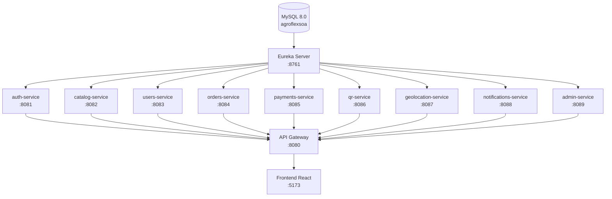
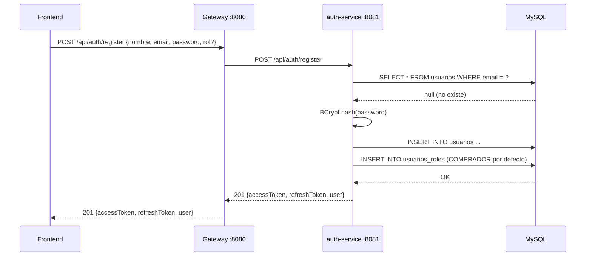
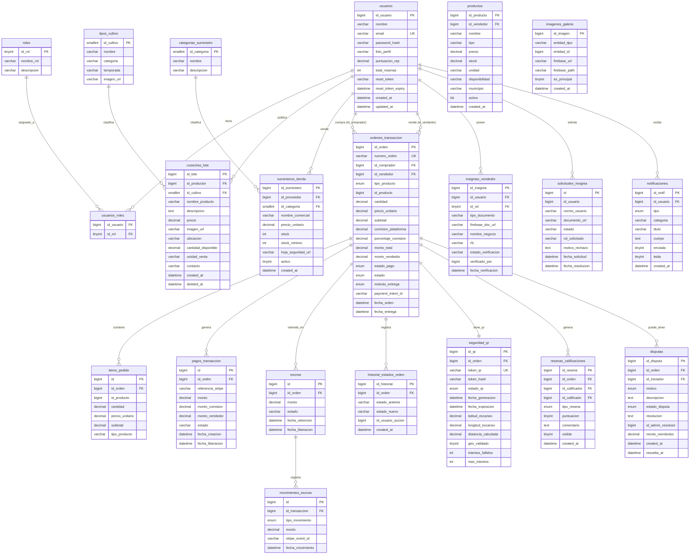
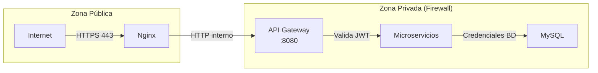
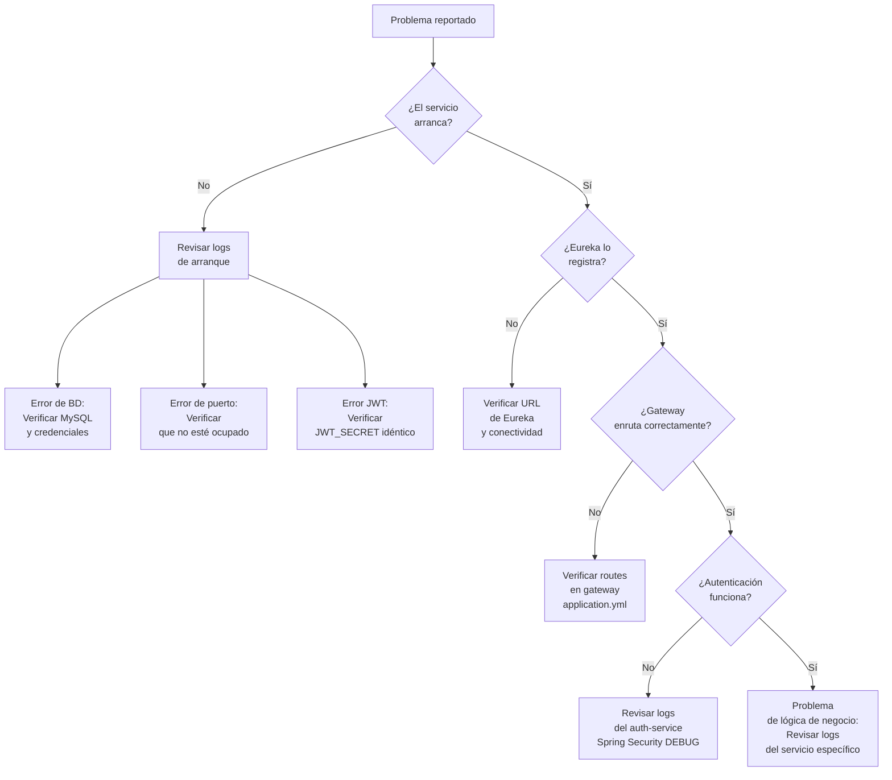

# MANUAL DE ADMINISTRADOR — AGROFLEX SOA

---

```
 █████╗  ██████╗ ██████╗  ██████╗ ███████╗██╗     ███████╗██╗  ██╗
██╔══██╗██╔════╝ ██╔══██╗██╔═══██╗██╔════╝██║     ██╔════╝╚██╗██╔╝
███████║██║  ███╗██████╔╝██║   ██║█████╗  ██║     █████╗   ╚███╔╝
██╔══██║██║   ██║██╔══██╗██║   ██║██╔══╝  ██║     ██╔══╝   ██╔██╗
██║  ██║╚██████╔╝██║  ██║╚██████╔╝██║     ███████╗███████╗██╔╝ ██╗
╚═╝  ╚═╝ ╚═════╝ ╚═╝  ╚═╝ ╚═════╝ ╚═╝     ╚══════╝╚══════╝╚═╝  ╚═╝
```

**Manual de Administrador del Sistema — Documentación Técnica Completa**

---

## Hoja de Control de Versiones

| Versión | Fecha | Autor | Descripción del cambio |
|---------|-------|-------|------------------------|
| 1.0.0 | 2026-03-24 | Equipo AgroFlex | Versión inicial del manual de administrador |
| 1.1.0 | 2026-04-01 | Equipo AgroFlex | Actualización de tablas de base de datos y microservicios |

---

## Tabla de Contenidos

1. [Introducción](#1-introducción)
2. [Requisitos Técnicos](#2-requisitos-técnicos)
3. [Instalación y Despliegue](#3-instalación-y-despliegue)
4. [Configuración del Sistema](#4-configuración-del-sistema)
5. [Gestión de Usuarios, Roles y Permisos](#5-gestión-de-usuarios-roles-y-permisos)
6. [Mantenimiento y Operaciones](#6-mantenimiento-y-operaciones)
7. [Administración de Datos — Esquema de Base de Datos](#7-administración-de-datos--esquema-de-base-de-datos)
8. [Seguridad y Cumplimiento](#8-seguridad-y-cumplimiento)
9. [Solución de Problemas Avanzada](#9-solución-de-problemas-avanzada)
10. [Glosario Técnico y Referencias](#10-glosario-técnico-y-referencias)

---

## 1. Introducción

### 1.1 Propósito del Manual

Este documento está dirigido a los administradores técnicos y DevOps responsables de instalar, configurar, mantener y operar la plataforma **AgroFlex SOA** en ambientes de desarrollo, staging y producción.

AgroFlex es un marketplace agrícola basado en arquitectura de microservicios (SOA) que conecta productores, compradores, proveedores y centros de empaque en la región Tepeaca-Acatzingo-Huixcolotla del estado de Puebla, México.

### 1.2 Alcance del Manual

Este manual cubre:
- Arquitectura completa del sistema y relaciones entre servicios
- Instalación desde cero en entorno local y producción
- Configuración de variables de entorno por servicio
- Gestión de la base de datos MySQL con schema completo
- Procedimientos de backup, logs y actualizaciones
- Administración de usuarios y control de acceso (RBAC)
- Seguridad JWT, CORS, y buenas prácticas
- Diagnóstico y resolución de errores técnicos

### 1.3 Roles del Administrador

| Rol | Responsabilidades |
|-----|-------------------|
| **Administrador del Sistema** | Gestión de microservicios, variables de entorno, certificados SSL |
| **Administrador de Base de Datos (DBA)** | Backups, migraciones SQL, optimización de queries |
| **Administrador de Plataforma** | Gestión de usuarios, insignias, disputas, catálogo en panel `/admin` |
| **DevOps / SRE** | Docker, CI/CD, monitoreo, escalabilidad |

### 1.4 Stack Tecnológico General

| Capa | Tecnología | Versión |
|------|-----------|---------|
| Backend | Spring Boot | 3.2.3 |
| Lenguaje Backend | Java | 17 |
| Service Discovery | Spring Cloud Netflix Eureka | 2023.0.0 |
| API Gateway | Spring Cloud Gateway | 2023.0.0 |
| Base de Datos | MySQL / MariaDB | 8.0 / 10.4.32 |
| ORM | Spring Data JPA / Hibernate | (incluido en Boot) |
| Seguridad | Spring Security + JJWT | 0.12.3 |
| Pagos | Stripe API | v9 SDK |
| Notificaciones Push | Firebase Admin SDK | 9.2.0 |
| Almacenamiento Imágenes | Cloudinary | REST API |
| Frontend | React + Vite | 18 / 5 |
| Estilos | Tailwind CSS | 3 |
| Estado Frontend | Zustand | (última estable) |
| HTTP Client Frontend | Axios | (última estable) |
| Enrutamiento Frontend | React Router | v6 |

---

## 2. Requisitos Técnicos

### 2.1 Requisitos de Hardware (Desarrollo)

| Componente | Mínimo | Recomendado |
|-----------|--------|-------------|
| CPU | 4 núcleos / 2.5 GHz | 8 núcleos / 3.0+ GHz |
| RAM | 8 GB | 16 GB |
| Disco | 20 GB libres | 50 GB SSD |
| Red | 10 Mbps | 100 Mbps |

> **Nota:** Cada microservicio Spring Boot consume ~256–512 MB RAM al arrancar. Con 12 servicios activos + MySQL + Frontend, se necesitan al menos 8 GB de RAM libre.

### 2.2 Requisitos de Hardware (Producción)

| Componente | Mínimo |
|-----------|--------|
| CPU | 8 vCPU |
| RAM | 32 GB |
| Disco | 200 GB SSD NVMe |
| Ancho de banda | 1 Gbps |
| OS | Ubuntu 22.04 LTS / AlmaLinux 9 |

### 2.3 Software Requerido

| Software | Versión | Propósito |
|---------|---------|-----------|
| JDK | 17 (LTS) | Compilar y ejecutar servicios Spring Boot |
| Apache Maven | 3.9+ | Build del backend |
| MySQL | 8.0+ | Base de datos principal |
| Node.js | 18+ LTS | Build y dev del frontend |
| npm | 9+ | Gestor de paquetes frontend |
| Docker | 24+ | Contenerización (opcional) |
| Docker Compose | 2.20+ | Orquestación local (opcional) |
| Git | 2.40+ | Control de versiones |

### 2.4 Puertos Requeridos

| Puerto | Servicio | Protocolo |
|--------|---------|-----------|
| 8080 | agroflex-gateway | HTTP |
| 8081 | agroflex-auth-service | HTTP |
| 8082 | agroflex-catalog-service | HTTP |
| 8083 | agroflex-users-service | HTTP |
| 8084 | agroflex-orders-service | HTTP |
| 8085 | agroflex-payments-service | HTTP |
| 8086 | agroflex-qr-service | HTTP |
| 8087 | agroflex-geolocation-service | HTTP |
| 8088 | agroflex-notifications-service | HTTP |
| 8089 | agroflex-admin-service | HTTP |
| 8761 | agroflex-eureka-server | HTTP |
| 3306 | MySQL | TCP |
| 5173 | agroflex-frontend (dev) | HTTP |
| 80/443 | Nginx (prod) | HTTP/HTTPS |

> **Seguridad:** En producción, SOLO los puertos 80/443 deben ser accesibles públicamente. Todos los puertos de microservicios (8080-8089, 8761) deben estar detrás del firewall/VPN.

---

## 3. Instalación y Despliegue

### 3.1 Estructura del Proyecto

```
AgroflexSOA/
│
├── 📄 agroflexsoa.sql                    ← Script inicializador de BD
├── 📄 docker-compose.yml                 ← Compose raíz
├── 📄 start-agroflex.ps1                 ← Script arranque (Windows)
├── 📄 stop-agroflex.ps1                  ← Script detención (Windows)
├── 📄 deploy-oracle.sh                   ← Script deploy Oracle Cloud
│
├── 📁 agroflex-backend/
│   ├── 📁 agroflex-eureka-server/        ← Service Registry (puerto 8761)
│   │   ├── pom.xml
│   │   └── src/main/
│   │       ├── java/com/agroflex/eureka/
│   │       │   └── EurekaServerApplication.java
│   │       └── resources/application.yml
│   │
│   ├── 📁 agroflex-gateway/              ← API Gateway (puerto 8080)
│   │   ├── pom.xml
│   │   └── src/main/
│   │       ├── java/com/agroflex/gateway/
│   │       │   └── GatewayApplication.java
│   │       └── resources/application.yml
│   │
│   ├── 📁 agroflex-auth-service/         ← Autenticación (puerto 8081) ✅ Operativo
│   │   ├── pom.xml
│   │   └── src/main/
│   │       ├── java/com/agroflex/auth/
│   │       │   ├── AuthApplication.java
│   │       │   ├── config/
│   │       │   ├── controller/           ← AuthController.java
│   │       │   ├── dto/                  ← Request/Response DTOs
│   │       │   ├── exception/            ← GlobalExceptionHandler.java
│   │       │   ├── model/                ← Usuario.java, Rol.java
│   │       │   ├── repository/           ← JPA Repositories
│   │       │   ├── security/             ← SecurityConfig, JwtFilter
│   │       │   └── service/              ← AuthService, JwtService
│   │       └── resources/application.yml
│   │
│   ├── 📁 agroflex-catalog-service/      ← Catálogo (puerto 8082) ✅ Operativo
│   │   ├── pom.xml
│   │   └── src/main/
│   │       ├── java/com/agroflex/catalog/
│   │       │   ├── CatalogApplication.java
│   │       │   ├── config/
│   │       │   ├── controller/
│   │       │   ├── dto/
│   │       │   ├── exception/
│   │       │   ├── model/
│   │       │   ├── repository/
│   │       │   ├── security/
│   │       │   └── service/
│   │       └── resources/application.yml
│   │
│   ├── 📁 agroflex-users-service/        ← Usuarios (puerto 8083) ⚠️ Stub
│   │   ├── pom.xml
│   │   └── src/main/java/com/agroflex/users/
│   │       └── UsersApplication.java
│   │
│   ├── 📁 agroflex-orders-service/       ← Órdenes (puerto 8084) ⚠️ Stub
│   │   ├── pom.xml
│   │   └── src/main/java/com/agroflex/orders/
│   │       └── OrdersApplication.java
│   │
│   ├── 📁 agroflex-payments-service/     ← Pagos/Stripe (puerto 8085) ⚠️ Stub
│   │   ├── pom.xml
│   │   └── src/main/java/com/agroflex/payments/
│   │       └── PaymentsApplication.java
│   │
│   ├── 📁 agroflex-qr-service/           ← Códigos QR (puerto 8086) ⚠️ Stub
│   │   ├── pom.xml
│   │   └── src/main/java/com/agroflex/qr/
│   │       └── AgroflexQrServiceApplication.java
│   │
│   ├── 📁 agroflex-geolocation-service/  ← Geolocalización (puerto 8087) ⚠️ Stub
│   │   ├── pom.xml
│   │   └── src/main/java/com/agroflex/geo/
│   │       └── GeoApplication.java
│   │
│   ├── 📁 agroflex-notifications-service/ ← Notificaciones (puerto 8088) ⚠️ Stub
│   │   ├── pom.xml
│   │   └── src/main/java/com/agroflex/notifications/
│   │       └── NotificationsApplication.java
│   │
│   ├── 📁 agroflex-admin-service/        ← Panel Admin (puerto 8089) ⚠️ Stub
│   │   ├── pom.xml
│   │   └── src/main/java/com/agroflex/admin/
│   │       └── AdminServiceApplication.java
│   │
│   └── 📁 docker/
│       ├── docker-compose.dev.yml
│       ├── docker-compose.yml
│       └── nginx/
│
├── 📁 agroflex-frontend/                 ← React App (puerto 5173 dev)
│   ├── package.json
│   ├── vite.config.js
│   ├── tailwind.config.js
│   ├── index.html
│   ├── Dockerfile
│   └── src/
│       ├── App.jsx
│       ├── index.css
│       └── ...
│
└── 📁 SOAarquitecture/
    ├── agroflex-arquitectura-overview.md
    ├── agroflexsoa.sql
    └── patch_*.sql                       ← Parches incrementales de BD
```

### 3.2 Flujo de Arranque de Servicios

El orden de inicio es **crítico**. Los servicios tienen dependencias entre sí:



**Regla de oro:** `MySQL` → `Eureka Server` → (todos los microservicios en paralelo) → `API Gateway` → `Frontend`

### 3.3 Instalación en Entorno Local (Paso a Paso)

#### Paso 1: Clonar el repositorio

```bash
git clone <URL_REPOSITORIO> AgroflexSOA
cd AgroflexSOA
```

#### Paso 2: Crear base de datos e inicializar schema

```sql
-- Conectar a MySQL como root
mysql -u root -p

-- Crear base de datos
CREATE DATABASE agroflexsoa CHARACTER SET utf8mb4 COLLATE utf8mb4_unicode_ci;
USE agroflexsoa;

-- Salir y ejecutar el script completo
EXIT;
```

```bash
# Ejecutar el script inicializador desde la raíz del proyecto
mysql -u root -p agroflexsoa < agroflexsoa.sql
```

> **IMPORTANTE:** El `agroflexsoa.sql` debe ejecutarse ANTES de arrancar cualquier microservicio. El `agroflex-auth-service` usa `ddl-auto: none`, lo que significa que NO creará tablas automáticamente; depende 100% de este script.

#### Paso 3: Arrancar Eureka Server

```bash
cd agroflex-backend/agroflex-eureka-server
mvn spring-boot:run
# Esperar mensaje: "Started EurekaServerApplication"
# Verificar en: http://localhost:8761
```

#### Paso 4: Arrancar Auth Service

```bash
cd ../agroflex-auth-service
mvn spring-boot:run
# Esperar mensaje: "Started AuthApplication"
```

#### Paso 5: Arrancar Catalog Service

```bash
cd ../agroflex-catalog-service
mvn spring-boot:run
# Esperar mensaje: "Started CatalogApplication"
```

#### Paso 6: Arrancar los demás servicios (en paralelo, terminales separadas)

```bash
# Terminal 4
cd agroflex-backend/agroflex-users-service && mvn spring-boot:run

# Terminal 5
cd agroflex-backend/agroflex-orders-service && mvn spring-boot:run

# Terminal 6
cd agroflex-backend/agroflex-payments-service && mvn spring-boot:run

# Terminal 7
cd agroflex-backend/agroflex-qr-service && mvn spring-boot:run

# Terminal 8
cd agroflex-backend/agroflex-geolocation-service && mvn spring-boot:run

# Terminal 9
cd agroflex-backend/agroflex-notifications-service && mvn spring-boot:run

# Terminal 10
cd agroflex-backend/agroflex-admin-service && mvn spring-boot:run
```

#### Paso 7: Arrancar el API Gateway

```bash
cd agroflex-backend/agroflex-gateway
mvn spring-boot:run
# Esperar mensaje: "Started GatewayApplication"
```

#### Paso 8: Arrancar el Frontend

```bash
cd agroflex-frontend
npm install
npm run dev
# Aplicación disponible en: http://localhost:5173
```

#### Paso 9: Verificar que todos los servicios estén registrados en Eureka

Abrir `http://localhost:8761` y verificar que aparezcan todos los microservicios en el dashboard de Eureka.

### 3.4 Script de Arranque Automatizado (Windows)

El proyecto incluye scripts PowerShell para arrancar y detener todos los servicios:

```powershell
# Arrancar todos los servicios
.\start-agroflex.ps1

# Detener todos los servicios
.\stop-agroflex.ps1
```

### 3.5 Inventario de Microservicios

| Servicio | Puerto | Estado | `ddl-auto` | Package Base | Clase Principal |
|---------|--------|--------|------------|--------------|-----------------|
| agroflex-eureka-server | 8761 | ✅ Operativo | N/A | `com.agroflex.eureka` | `EurekaServerApplication` |
| agroflex-gateway | 8080 | ✅ Operativo | N/A | `com.agroflex.gateway` | `GatewayApplication` |
| agroflex-auth-service | 8081 | ✅ Operativo | **none** | `com.agroflex.auth` | `AuthApplication` |
| agroflex-catalog-service | 8082 | ✅ Operativo | update | `com.agroflex.catalog` | `CatalogApplication` |
| agroflex-users-service | 8083 | ⚠️ Stub | update | `com.agroflex.users` | `UsersApplication` |
| agroflex-orders-service | 8084 | ⚠️ Stub | update | `com.agroflex.orders` | `OrdersApplication` |
| agroflex-payments-service | 8085 | ⚠️ Stub | update | `com.agroflex.payments` | `PaymentsApplication` |
| agroflex-qr-service | 8086 | ⚠️ Stub | update | `com.agroflex.qr` | `AgroflexQrServiceApplication` |
| agroflex-geolocation-service | 8087 | ⚠️ Stub | update | `com.agroflex.geo` | `GeoApplication` |
| agroflex-notifications-service | 8088 | ⚠️ Stub | update | `com.agroflex.notifications` | `NotificationsApplication` |
| agroflex-admin-service | 8089 | ⚠️ Stub | update | `com.agroflex.admin` | `AdminServiceApplication` |
| agroflex-frontend | 5173 | ✅ Operativo | N/A | React/Vite | App.jsx |

> **Leyenda:**
> - ✅ **Operativo:** Servicio completamente implementado con lógica de negocio.
> - ⚠️ **Stub:** Servicio arranca y se registra en Eureka, pero los endpoints de negocio están pendientes de implementación.

### 3.6 Despliegue con Docker Compose

```bash
# Desde la raíz del proyecto
docker-compose up -d

# Ver estado de contenedores
docker-compose ps

# Ver logs de un servicio específico
docker-compose logs -f agroflex-auth-service

# Detener todos los contenedores
docker-compose down
```

Para el entorno de desarrollo con hot-reload:

```bash
cd agroflex-backend/docker
docker-compose -f docker-compose.dev.yml up -d
```

---

## 4. Configuración del Sistema

### 4.1 Variables de Entorno Críticas

#### Variables globales (compartidas por todos los servicios)

| Variable | Valor por defecto (dev) | Descripción | Obligatoria en Prod |
|---------|------------------------|-------------|---------------------|
| `JWT_SECRET` | `agroflex_dev_secret_256bits_cambiar_en_prod_agroflex_secret` | Clave secreta para firmar JWTs. **Debe ser idéntica en TODOS los servicios.** | ✅ Sí |
| `DB_USER` | `root` | Usuario de MySQL | ✅ Sí |
| `DB_PASS` | `` (vacío) | Contraseña de MySQL | ✅ Sí |
| `EUREKA_URL` | `http://localhost:8761/eureka` | URL del Eureka Server | ✅ Sí (si no es localhost) |

#### Variables específicas del Auth Service

| Variable | Valor por defecto | Descripción |
|---------|------------------|-------------|
| `MAIL_HOST` | smtp.gmail.com | Servidor SMTP para recuperación de contraseña |
| `MAIL_PORT` | 587 | Puerto SMTP (STARTTLS) |
| `MAIL_USERNAME` | — | Email de la cuenta remitente |
| `MAIL_PASSWORD` | — | App Password de Gmail (no la contraseña regular) |
| `MAIL_FROM` | — | Dirección `From:` en los emails |

#### Variables específicas del Payments Service

| Variable | Valor por defecto | Descripción |
|---------|------------------|-------------|
| `STRIPE_SECRET_KEY` | — | Clave secreta de Stripe (`sk_live_...` o `sk_test_...`) |
| `STRIPE_WEBHOOK_SECRET` | — | Secret para verificar webhooks de Stripe (`whsec_...`) |
| `ORDERS_SERVICE_URL` | `http://localhost:8084` | URL interna del orders-service |

#### Variables específicas del Orders Service

| Variable | Valor por defecto | Descripción |
|---------|------------------|-------------|
| `CATALOG_SERVICE_URL` | `http://localhost:8082` | URL del catalog-service |
| `PAYMENTS_SERVICE_URL` | `http://localhost:8085` | URL del payments-service |
| `QR_SERVICE_URL` | `http://localhost:8086` | URL del qr-service |
| `NOTIFICATIONS_SERVICE_URL` | `http://localhost:8088` | URL del notifications-service |

### 4.2 Archivo `application.yml` — API Gateway (Puerto 8080)

```yaml
spring:
  application:
    name: agroflex-gateway
  cloud:
    gateway:
      routes:
        - id: auth-route
          uri: http://localhost:8081
          predicates:
            - Path=/api/auth/**

        - id: catalog-route
          uri: http://localhost:8082
          predicates:
            - Path=/api/catalog/**,/api/productos/**,/api/cosechas/**,/api/suministros/**

        - id: users-route
          uri: http://localhost:8083
          predicates:
            - Path=/api/users/**

        - id: orders-route
          uri: http://localhost:8084
          predicates:
            - Path=/api/orders/**

        - id: payments-route
          uri: http://localhost:8085
          predicates:
            - Path=/api/payments/**

        - id: qr-route
          uri: http://localhost:8086
          predicates:
            - Path=/api/qr/**

        - id: geolocation-route
          uri: http://localhost:8087
          predicates:
            - Path=/api/geolocation/**

        - id: notifications-route
          uri: http://localhost:8088
          predicates:
            - Path=/api/notifications/**

        - id: admin-route
          uri: http://localhost:8089
          predicates:
            - Path=/api/admin/**

server:
  port: 8080

jwt:
  secret: ${JWT_SECRET:agroflex_dev_secret_256bits_cambiar_en_prod_agroflex_secret}

eureka:
  client:
    service-url:
      defaultZone: http://localhost:8761/eureka/
```

### 4.3 Archivo `application.yml` — Auth Service (Puerto 8081)

```yaml
server:
  port: 8081

spring:
  application:
    name: agroflex-auth-service
  datasource:
    url: jdbc:mysql://localhost:3306/agroflexsoa?useSSL=false&serverTimezone=America/Mexico_City&allowPublicKeyRetrieval=true
    username: ${DB_USER:root}
    password: ${DB_PASS:}
  jpa:
    hibernate:
      ddl-auto: none          # ← CRÍTICO: no modifica schema automáticamente
    show-sql: false
  mail:
    host: ${MAIL_HOST:smtp.gmail.com}
    port: ${MAIL_PORT:587}
    username: ${MAIL_USERNAME:}
    password: ${MAIL_PASSWORD:}
    properties:
      mail.smtp.starttls.enable: true

jwt:
  secret: ${JWT_SECRET:agroflex_dev_secret_256bits_cambiar_en_prod_agroflex_secret}
  expiration: 86400000        # 24 horas en ms
  refresh-expiration: 604800000  # 7 días en ms

logging:
  level:
    com.agroflex.auth: DEBUG
    org.springframework.security: DEBUG

eureka:
  client:
    service-url:
      defaultZone: ${EUREKA_URL:http://localhost:8761/eureka}
```

### 4.4 Archivo `application.yml` — Catalog Service (Puerto 8082)

```yaml
server:
  port: 8082

spring:
  application:
    name: agroflex-catalog-service
  datasource:
    url: jdbc:mysql://localhost:3306/agroflexsoa?useSSL=false&serverTimezone=America/Mexico_City&allowPublicKeyRetrieval=true
    username: ${DB_USER:root}
    password: ${DB_PASS:}
    hikari:
      connection-timeout: 30000
      initialization-fail-timeout: 60000
  jpa:
    hibernate:
      ddl-auto: update        # ← Crea/actualiza tablas automáticamente

jwt:
  secret: ${JWT_SECRET:agroflex_dev_secret_256bits_cambiar_en_prod_agroflex_secret}

logging:
  level:
    com.agroflex.catalog: DEBUG
    org.hibernate.SQL: DEBUG

eureka:
  client:
    service-url:
      defaultZone: ${EUREKA_URL:http://localhost:8761/eureka}
```

### 4.5 Archivo `application.yml` — Orders Service (Puerto 8084)

```yaml
server:
  port: 8084

spring:
  application:
    name: agroflex-orders-service
  datasource:
    url: jdbc:mysql://localhost:3306/agroflexsoa?useSSL=false&serverTimezone=America/Mexico_City
    username: ${DB_USER:root}
    password: ${DB_PASS:}
  jpa:
    hibernate:
      ddl-auto: update

jwt:
  secret: ${JWT_SECRET:agroflex_dev_secret_256bits_cambiar_en_prod_agroflex_secret}

services:
  catalog:
    url: ${CATALOG_SERVICE_URL:http://localhost:8082}
  payments:
    url: ${PAYMENTS_SERVICE_URL:http://localhost:8085}
  qr:
    url: ${QR_SERVICE_URL:http://localhost:8086}
  notifications:
    url: ${NOTIFICATIONS_SERVICE_URL:http://localhost:8088}

feign:
  client:
    config:
      default:
        connectTimeout: 3000
        readTimeout: 8000
      agroflex-catalog-service:
        connectTimeout: 3000
        readTimeout: 6000
      agroflex-qr-service:
        connectTimeout: 2000
        readTimeout: 4000

eureka:
  client:
    service-url:
      defaultZone: ${EUREKA_URL:http://localhost:8761/eureka}
```

### 4.6 Archivo `application.yml` — Payments Service (Puerto 8085)

```yaml
server:
  port: 8085

spring:
  application:
    name: agroflex-payments-service
  datasource:
    url: jdbc:mysql://localhost:3306/agroflexsoa?useSSL=false&serverTimezone=America/Mexico_City
    username: ${DB_USER:root}
    password: ${DB_PASS:}
  jpa:
    hibernate:
      ddl-auto: update

stripe:
  secret-key: ${STRIPE_SECRET_KEY:}
  webhook-secret: ${STRIPE_WEBHOOK_SECRET:}
  comision-porcentaje: 3.5

jwt:
  secret: ${JWT_SECRET:agroflex_dev_secret_256bits_cambiar_en_prod_agroflex_secret}

services:
  orders:
    url: ${ORDERS_SERVICE_URL:http://localhost:8084}

feign:
  client:
    config:
      default:
        connectTimeout: 5000
        readTimeout: 15000

management:
  endpoints:
    web:
      exposure:
        include: health,info

eureka:
  client:
    service-url:
      defaultZone: ${EUREKA_URL:http://localhost:8761/eureka}
```

### 4.7 Configuración de JWT

El JWT es el mecanismo central de autenticación en AgroFlex. Todos los servicios que validan tokens deben compartir exactamente la misma `JWT_SECRET`.

**Estructura del JWT Payload:**

```json
{
  "sub": "usuario@email.com",
  "roles": ["PRODUCTOR"],
  "iat": 1711234567,
  "exp": 1711320967
}
```

| Campo | Descripción |
|-------|-------------|
| `sub` | Email del usuario (subject) |
| `roles` | Array de roles asignados |
| `iat` | Issued At — timestamp de emisión |
| `exp` | Expiration — timestamp de expiración |

**Tiempos de expiración:**
- Access Token: **24 horas** (86400000 ms)
- Refresh Token: **7 días** (604800000 ms)

**Para producción, generar un secret seguro:**

```bash
# Generar secret aleatorio de 256 bits en Base64
openssl rand -base64 32
```

### 4.8 Configuración del Frontend

El frontend configura su API base URL en `vite.config.js`:

```javascript
// agroflex-frontend/vite.config.js
export default defineConfig({
  server: {
    proxy: {
      '/api': 'http://localhost:8080'  // ← apunta al Gateway
    }
  }
})
```

Para producción, configurar en variable de entorno:

```bash
# agroflex-frontend/.env.production
VITE_API_BASE_URL=https://api.agroflex.mx
```

---

## 5. Gestión de Usuarios, Roles y Permisos

### 5.1 Sistema RBAC

AgroFlex implementa **Role-Based Access Control (RBAC)** a través de tres tablas en MySQL y Spring Security en el backend.

### 5.2 Catálogo de Roles

| ID | Nombre | Descripción | Dashboard |
|----|--------|-------------|-----------|
| 1 | **PRODUCTOR** | Agricultor que vende lotes de cosecha directamente | `/producer/dashboard` |
| 2 | **INVERNADERO** | Operador de invernadero con producción controlada | `/producer/dashboard` |
| 3 | **PROVEEDOR** | Proveedor de agroinsumos y agroquímicos | `/supplier/dashboard` |
| 4 | **EMPAQUE** | Centro de empaque y procesamiento | `/producer/dashboard` |
| 5 | **COMPRADOR** | Comprador de lotes o suministros | `/buyer/dashboard` |
| 6 | **ADMIN** | Administrador de la plataforma AgroFlex | `/admin/dashboard` |

**Rol por defecto al registro:** `COMPRADOR` (ID 5)

### 5.3 Estructura de Paquetes del Auth Service

```
com.agroflex.auth/
├── AuthApplication.java              ← Clase principal @SpringBootApplication
├── config/                           ← Configuraciones adicionales
├── controller/
│   └── AuthController.java           ← 5 endpoints REST
├── dto/
│   ├── LoginRequest.java             ← {email, password}
│   ├── RegisterRequest.java          ← {nombre, email, password, ...}
│   ├── AuthResponse.java             ← {accessToken, refreshToken, user}
│   ├── RefreshTokenRequest.java      ← {refreshToken}
│   ├── ForgotPasswordRequest.java    ← {email}
│   └── ResetPasswordRequest.java     ← {token, newPassword}
├── exception/
│   └── GlobalExceptionHandler.java   ← Manejo centralizado de errores
├── model/
│   ├── Usuario.java                  ← Entidad JPA
│   └── Rol.java                      ← Entidad JPA
├── repository/
│   ├── UsuarioRepository.java        ← JpaRepository<Usuario, Long>
│   └── RolRepository.java            ← JpaRepository<Rol, Integer>
├── security/
│   ├── SecurityConfig.java           ← @EnableWebSecurity
│   ├── JwtAuthenticationFilter.java  ← OncePerRequestFilter
│   └── ErrorResponse.java            ← DTO de error HTTP
└── service/
    ├── AuthService.java              ← Lógica de registro, login, etc.
    ├── JwtService.java               ← Generación y validación de tokens
    ├── UserDetailsServiceImpl.java   ← Spring Security UserDetails
    └── RolService.java               ← Gestión de roles
```

### 5.4 Endpoints de Autenticación

| Método | Endpoint | Descripción | Auth requerida |
|--------|---------|-------------|----------------|
| `POST` | `/api/auth/register` | Registro de nuevo usuario | No |
| `POST` | `/api/auth/login` | Login con email/contraseña | No |
| `POST` | `/api/auth/refresh` | Renovar access token | No (requiere refreshToken) |
| `POST` | `/api/auth/forgot-password` | Solicitar email de recuperación | No |
| `POST` | `/api/auth/reset-password` | Cambiar contraseña con token | No (requiere reset token) |

### 5.5 Flujo de Registro de Usuario



### 5.6 Formato de Respuesta de Error Estándar

Todos los servicios responden errores con el siguiente formato JSON:

```json
{
  "error": "INVALID_CREDENTIALS",
  "message": "Email o contraseña incorrectos",
  "timestamp": "2026-03-24T10:15:30.000Z",
  "details": {}
}
```

| Código HTTP | Error Code | Descripción |
|-------------|-----------|-------------|
| 400 | `VALIDATION_ERROR` | Campos requeridos faltantes o inválidos |
| 401 | `INVALID_CREDENTIALS` | Email o contraseña incorrectos |
| 401 | `TOKEN_EXPIRED` | JWT expirado, hacer refresh |
| 401 | `TOKEN_INVALID` | JWT malformado o firma incorrecta |
| 404 | `USER_NOT_FOUND` | El email no existe en el sistema |
| 409 | `EMAIL_ALREADY_EXISTS` | El email ya está registrado |
| 500 | `INTERNAL_ERROR` | Error interno del servidor |

### 5.7 Asignar Rol ADMIN a un Usuario (Desde MySQL)

Para otorgar rol ADMIN a un usuario existente:

```sql
-- 1. Verificar el ID del usuario
SELECT id_usuario, nombre, email FROM usuarios WHERE email = 'admin@agroflex.mx';

-- 2. Verificar los roles actuales
SELECT r.nombre_rol FROM roles r
JOIN usuarios_roles ur ON r.id_rol = ur.id_rol
WHERE ur.id_usuario = <ID_USUARIO>;

-- 3. Agregar rol ADMIN
INSERT INTO usuarios_roles (id_usuario, id_rol)
SELECT <ID_USUARIO>, id_rol FROM roles WHERE nombre_rol = 'ADMIN';

-- 4. Opcional: Remover rol COMPRADOR
DELETE ur FROM usuarios_roles ur
JOIN roles r ON ur.id_rol = r.id_rol
WHERE ur.id_usuario = <ID_USUARIO> AND r.nombre_rol = 'COMPRADOR';
```

### 5.8 Gestión de Insignias (Panel Admin)

Las insignias verifican que un productor o proveedor es un negocio legítimo. El flujo:

1. Usuario solicita insignia en `/verify-badge`
2. Sube documentos (INE, RFC, ACTA_CONSTITUTIVA, o PERMISO_SAGARPA) a Firebase Storage
3. Se crea registro en `solicitudes_insignia` con estado `PENDIENTE`
4. Admin revisa en `/admin/insignias`
5. Admin aprueba → `insignias_vendedor.estado_verificacion = 'VERIFICADO'`
6. Admin rechaza → `solicitudes_insignia.motivo_rechazo` se registra

---

## 6. Mantenimiento y Operaciones

### 6.1 Backups de Base de Datos

#### Backup completo con mysqldump

```bash
# Backup completo
mysqldump -u root -p agroflexsoa > backup_agroflexsoa_$(date +%Y%m%d_%H%M).sql

# Backup con compresión
mysqldump -u root -p agroflexsoa | gzip > backup_agroflexsoa_$(date +%Y%m%d_%H%M).sql.gz

# Backup solo de tablas críticas (datos de usuarios y transacciones)
mysqldump -u root -p agroflexsoa \
  usuarios roles usuarios_roles \
  ordenes_transaccion pagos_transaccion \
  seguridad_qr escrow movimientos_escrow \
  > backup_critico_$(date +%Y%m%d_%H%M).sql
```

#### Restaurar backup

```bash
# Restaurar backup completo
mysql -u root -p agroflexsoa < backup_agroflexsoa_20260324.sql

# Restaurar backup comprimido
gunzip -c backup_agroflexsoa_20260324.sql.gz | mysql -u root -p agroflexsoa
```

#### Script de backup automatizado (cron)

```bash
# Agregar al crontab: crontab -e
# Backup diario a las 2:00 AM
0 2 * * * mysqldump -u root -p<PASSWORD> agroflexsoa | gzip > /backups/agroflex_$(date +\%Y\%m\%d).sql.gz

# Limpiar backups con más de 30 días
0 3 * * * find /backups -name "agroflex_*.sql.gz" -mtime +30 -delete
```

### 6.2 Gestión de Logs

Los microservicios Spring Boot generan logs en la salida estándar (stdout). Para persistir logs:

#### Configurar logging por archivo en `application.yml`

```yaml
logging:
  file:
    name: logs/agroflex-auth-service.log
  logback:
    rollingpolicy:
      max-file-size: 10MB
      max-history: 30
      total-size-cap: 3GB
  level:
    com.agroflex: INFO
    org.springframework.security: WARN
    org.hibernate.SQL: WARN
```

#### Consultar logs en tiempo real

```bash
# Log de un servicio específico
tail -f logs/agroflex-auth-service.log

# Buscar errores en logs
grep -i "ERROR\|EXCEPTION" logs/agroflex-auth-service.log

# Buscar logins fallidos
grep "INVALID_CREDENTIALS\|401" logs/agroflex-auth-service.log
```

#### Logs con Docker

```bash
# Logs en tiempo real de un contenedor
docker-compose logs -f agroflex-auth-service

# Últimas 100 líneas de logs
docker-compose logs --tail=100 agroflex-gateway

# Logs de todos los servicios con timestamps
docker-compose logs --timestamps
```

### 6.3 Monitoreo de Salud

Spring Boot Actuator expone endpoints de health en los servicios configurados:

```bash
# Verificar salud del gateway
curl http://localhost:8080/actuator/health

# Verificar salud del auth-service
curl http://localhost:8081/actuator/health

# Verificar todos los servicios en Eureka
curl http://localhost:8761/eureka/apps | python -m json.tool
```

### 6.4 Aplicar Parches SQL

Los parches incrementales se encuentran en `SOAarquitecture/`:

```bash
# Aplicar parche de foto de perfil
mysql -u root -p agroflexsoa < SOAarquitecture/patch_foto_perfil.sql

# Aplicar parche de stock decimal
mysql -u root -p agroflexsoa < SOAarquitecture/patch_productos_stock_decimal.sql
```

> **Procedimiento:** Siempre hacer backup ANTES de aplicar cualquier parche SQL en producción.

### 6.5 Actualización de Microservicios

```bash
# Compilar y empaquetar un servicio
cd agroflex-backend/agroflex-auth-service
mvn clean package -DskipTests

# El JAR generado estará en:
ls target/agroflex-auth-service-1.0.0.jar

# Ejecutar el JAR directamente (producción)
java -jar target/agroflex-auth-service-1.0.0.jar \
  --JWT_SECRET=<SECRET_PROD> \
  --DB_USER=<DB_USER> \
  --DB_PASS=<DB_PASS>
```

### 6.6 Mantenimiento del Frontend

```bash
# Instalar dependencias
cd agroflex-frontend
npm install

# Build para producción
npm run build
# Genera la carpeta dist/ con archivos estáticos optimizados

# Preview del build
npm run preview

# Actualizar dependencias
npm update
```

---

## 7. Administración de Datos — Esquema de Base de Datos

### 7.1 Descripción General

La base de datos `agroflexsoa` contiene **20 tablas** organizadas en 5 dominios funcionales:

| Dominio | Tablas |
|---------|--------|
| **Identidad y Acceso** | `usuarios`, `roles`, `usuarios_roles` |
| **Catálogo de Productos** | `productos`, `cosechas_lote`, `suministros_tienda`, `tipos_cultivo`, `categorias_suministro`, `imagenes_galeria` |
| **Transacciones** | `ordenes_transaccion`, `items_pedido`, `pagos_transaccion`, `escrow`, `movimientos_escrow`, `historial_estados_orden` |
| **Social y Confianza** | `insignias_vendedor`, `solicitudes_insignia`, `reseñas_calificaciones` |
| **Seguridad y Soporte** | `seguridad_qr`, `disputas`, `notificaciones`, `transacciones` |

### 7.2 Diagrama Entidad-Relación (ER)



### 7.3 Tablas Críticas — Referencia Detallada

#### `usuarios` — Tabla central de identidad

```sql
CREATE TABLE `usuarios` (
  `id_usuario` bigint(20) UNSIGNED NOT NULL AUTO_INCREMENT,
  `nombre`     varchar(150) NOT NULL,
  `email`      varchar(180) NOT NULL UNIQUE,
  `password_hash` varchar(255) NOT NULL,        -- BCrypt hash
  `foto_perfil`   varchar(512) DEFAULT NULL,    -- URL Cloudinary/Firebase
  `puntuacion_rep` decimal(3,2) DEFAULT 0.00,  -- Promedio reseñas (0.00–5.00)
  `total_resenas`  int(11) DEFAULT 0,
  `reset_token`    varchar(36) DEFAULT NULL,   -- UUID para recuperación de contraseña
  `reset_token_expiry` datetime DEFAULT NULL,  -- Expira en 1 hora
  `created_at`  datetime NOT NULL DEFAULT current_timestamp(),
  `updated_at`  datetime NOT NULL DEFAULT current_timestamp() ON UPDATE current_timestamp(),
  PRIMARY KEY (`id_usuario`)
);
```

#### `ordenes_transaccion` — Núcleo transaccional

Estados posibles de `estado_pago`:

```
PENDIENTE_PAGO → PAGO_RETENIDO → EN_TRANSITO → LISTO_VALIDACION → PAGO_LIBERADO
                                                                ↘
                                                            REEMBOLSADO
                              ↘
                          DISPUTADO
         ↘
      CANCELADO
```

Estados posibles de `estado` (orden operativa):

```
PENDIENTE → CONFIRMADO → EN_TRANSITO → LISTO_ENTREGA → ENTREGADO → COMPLETADO
         ↘                                                         ↗
       CANCELADO ← ← ← ← ← ← ← ← ← ← ← ← ← ← ← ← ← DISPUTADO
```

#### `seguridad_qr` — Sistema QR para validación de entrega

El QR se genera con las siguientes características:
- **Token:** UUID v4 + HMAC-SHA256 firmado → guardado en `token_qr`
- **Hash:** Almacenado en `token_hash` para verificación sin exponer el token en texto plano
- **Expiración:** 48 horas desde generación (`fecha_expiracion`)
- **Validación GPS:** El sistema verifica que el escaneo ocurra dentro de `radio_tolerancia_m` (default: 500 metros) de las coordenadas esperadas
- **Intentos:** Máximo `max_intentos` antes de invalidar el QR (`estado_qr = 'INVALIDO'`)

### 7.4 Triggers de Base de Datos

| Trigger | Tabla | Evento | Descripción |
|---------|-------|--------|-------------|
| `trg_generar_numero_orden` | `ordenes_transaccion` | BEFORE INSERT | Genera número de orden `AGF-YYYY-000001` |
| `trg_historial_orden` | `ordenes_transaccion` | AFTER UPDATE | Registra cambios de `estado_pago` en `historial_estados_orden` |
| `trg_reducir_stock_suministro` | `ordenes_transaccion` | AFTER INSERT | Reduce stock en `suministros_tienda` cuando se compra un suministro |
| `trg_reducir_cantidad_cosecha` | `ordenes_transaccion` | AFTER INSERT | Reduce stock en `productos` cuando se compra una cosecha |
| `trg_actualizar_reputacion` | `reseñas_calificaciones` | AFTER INSERT | Recalcula `puntuacion_rep` y `total_reseñas` en `usuarios` |

### 7.5 Consultas de Administración Frecuentes

#### Usuarios por rol

```sql
SELECT r.nombre_rol, COUNT(ur.id_usuario) AS total
FROM roles r
LEFT JOIN usuarios_roles ur ON r.id_rol = ur.id_rol
GROUP BY r.nombre_rol
ORDER BY total DESC;
```

#### Órdenes pendientes de pago

```sql
SELECT o.numero_orden, u_c.nombre AS comprador, u_v.nombre AS vendedor,
       o.monto_total, o.estado_pago, o.fecha_orden
FROM ordenes_transaccion o
JOIN usuarios u_c ON o.id_comprador = u_c.id_usuario
JOIN usuarios u_v ON o.id_vendedor = u_v.id_usuario
WHERE o.estado_pago = 'PENDIENTE_PAGO'
ORDER BY o.fecha_orden DESC;
```

#### Ingresos de la plataforma por comisiones

```sql
SELECT
  DATE_FORMAT(fecha_orden, '%Y-%m') AS mes,
  COUNT(*) AS total_ordenes,
  SUM(monto_total) AS volumen_total,
  SUM(comision_plataforma) AS ingresos_agroflex
FROM ordenes_transaccion
WHERE estado_pago = 'PAGO_LIBERADO'
GROUP BY mes
ORDER BY mes DESC;
```

#### QR expirados sin validar

```sql
SELECT sq.id_qr, sq.id_orden, o.numero_orden, sq.fecha_expiracion, sq.estado_qr
FROM seguridad_qr sq
JOIN ordenes_transaccion o ON sq.id_orden = o.id_orden
WHERE sq.estado_qr = 'GENERADO' AND sq.fecha_expiracion < NOW()
ORDER BY sq.fecha_expiracion ASC;

-- Marcarlos como expirados
UPDATE seguridad_qr SET estado_qr = 'EXPIRADO'
WHERE estado_qr = 'GENERADO' AND fecha_expiracion < NOW();
```

#### Solicitudes de insignia pendientes

```sql
SELECT s.id, u.nombre, u.email, s.rol_solicitado,
       s.motivo_solicitud, s.fecha_solicitud
FROM solicitudes_insignia s
JOIN usuarios u ON s.id_usuario = u.id_usuario
WHERE s.estado = 'PENDIENTE'
ORDER BY s.fecha_solicitud ASC;
```

---

## 8. Seguridad y Cumplimiento

### 8.1 Modelo de Seguridad en Capas



### 8.2 Seguridad del API Gateway

El Gateway aplica las siguientes medidas:
- **Validación JWT:** Verifica firma y expiración del token en cada request
- **CORS:** Configurar `allowed-origins` para solo aceptar el dominio del frontend
- **Rate Limiting:** Configurar con Spring Cloud Gateway `RequestRateLimiter` (Redis)
- **Headers de seguridad:** Agregar `X-Content-Type-Options`, `X-Frame-Options`, `Strict-Transport-Security`

### 8.3 Seguridad de JWT

**Malas prácticas a evitar:**

```
❌ Nunca usar el secret por defecto en producción
❌ Nunca exponer JWT_SECRET en logs o código fuente
❌ Nunca almacenar el JWT en localStorage (usar HttpOnly cookies o memoria)
❌ Nunca deshabilitar la validación de expiración
```

**Buenas prácticas:**

```
✅ Usar JWT_SECRET de mínimo 256 bits generado aleatoriamente
✅ Rotar el secret cada 6-12 meses con migración controlada
✅ Invalidar refresh tokens al cerrar sesión (añadir blacklist en Redis)
✅ Usar HTTPS en producción (TLS 1.2+)
✅ Verificar rol/autorización en CADA endpoint protegido
```

### 8.4 Seguridad de la Base de Datos

```sql
-- Crear usuario específico para la aplicación (NO usar root en producción)
CREATE USER 'agroflex_app'@'localhost' IDENTIFIED BY '<PASSWORD_FUERTE>';

-- Otorgar solo los permisos necesarios
GRANT SELECT, INSERT, UPDATE, DELETE ON agroflexsoa.* TO 'agroflex_app'@'localhost';

-- Denegar operaciones peligrosas
REVOKE DROP, CREATE, ALTER ON agroflexsoa.* FROM 'agroflex_app'@'localhost';

FLUSH PRIVILEGES;
```

### 8.5 Variables de Entorno en Producción

**Nunca hardcodear secrets en archivos de configuración.** Usar variables de entorno del sistema operativo:

```bash
# Linux/Mac — agregar a /etc/environment o ~/.profile
export JWT_SECRET="$(openssl rand -base64 64)"
export DB_USER="agroflex_app"
export DB_PASS="<PASSWORD_FUERTE>"
export STRIPE_SECRET_KEY="sk_live_..."
export STRIPE_WEBHOOK_SECRET="whsec_..."
export MAIL_PASSWORD="<APP_PASSWORD_GMAIL>"
```

O usar un gestor de secrets como **HashiCorp Vault**, **AWS Secrets Manager**, o **Azure Key Vault**.

### 8.6 Configuración CORS

En el gateway, restringir CORS al dominio del frontend:

```yaml
spring:
  cloud:
    gateway:
      globalcors:
        cors-configurations:
          '[/**]':
            allowedOrigins:
              - "https://agroflex.mx"
              - "https://www.agroflex.mx"
            allowedMethods:
              - GET
              - POST
              - PUT
              - DELETE
              - OPTIONS
            allowedHeaders: "*"
            allowCredentials: true
            maxAge: 3600
```

### 8.7 Seguridad de Stripe

- Usar `STRIPE_WEBHOOK_SECRET` para verificar la autenticidad de cada webhook
- Validar el `payment_intent_id` en el backend antes de liberar fondos del escrow
- Nunca procesar pagos en el frontend directamente
- Usar modo `test` (`sk_test_...`) durante desarrollo y `live` (`sk_live_...`) en producción

### 8.8 Tokens de Recuperación de Contraseña

Los tokens de reset se almacenan en `usuarios.reset_token` (UUID v4) con expiración de 1 hora (`reset_token_expiry`). Limpiar periódicamente tokens expirados:

```sql
-- Limpiar tokens de reset expirados
UPDATE usuarios
SET reset_token = NULL, reset_token_expiry = NULL
WHERE reset_token_expiry < NOW() AND reset_token IS NOT NULL;
```

---

## 9. Solución de Problemas Avanzada

### 9.1 Árbol de Diagnóstico General



### 9.2 Problemas Frecuentes y Soluciones

#### Problema: Servicio no arranca — Error de conexión a MySQL

**Síntoma:**
```
com.mysql.cj.jdbc.exceptions.CommunicationsException: Communications link failure
```

**Causas y soluciones:**

| Causa | Solución |
|-------|---------|
| MySQL no está corriendo | `sudo systemctl start mysql` o iniciar XAMPP |
| Puerto 3306 bloqueado | `netstat -an | grep 3306` |
| Credenciales incorrectas | Verificar `DB_USER` y `DB_PASS` en `application.yml` |
| Base de datos no existe | Crear BD: `CREATE DATABASE agroflexsoa;` |
| URL de conexión errónea | Verificar `spring.datasource.url` |

#### Problema: 401 Unauthorized en todos los endpoints

**Síntoma:** Todos los requests retornan `401 Unauthorized` aunque se envía token.

**Diagnóstico:**

```bash
# Verificar que el JWT_SECRET es idéntico en TODOS los servicios
grep -r "JWT_SECRET\|jwt.secret" agroflex-backend/*/src/main/resources/application.yml

# Decodificar el JWT para verificar claims (https://jwt.io)
echo "<TOKEN>" | cut -d'.' -f2 | base64 -d 2>/dev/null | python -m json.tool
```

**Causas:**
1. `JWT_SECRET` diferente entre el servicio que emitió el token y el que lo valida
2. Token expirado (`exp` en el pasado)
3. Token con formato incorrecto (falta `Bearer ` prefix)

#### Problema: Microservicio no aparece en Eureka

**Síntoma:** Dashboard de Eureka en `http://localhost:8761` no muestra el servicio.

**Verificar:**

```yaml
# En application.yml del servicio:
eureka:
  client:
    service-url:
      defaultZone: ${EUREKA_URL:http://localhost:8761/eureka}
  instance:
    prefer-ip-address: true
```

```bash
# Verificar que Eureka Server esté corriendo
curl http://localhost:8761/actuator/health

# Verificar registro manual
curl http://localhost:8761/eureka/apps/<NOMBRE_SERVICIO>
```

#### Problema: `ddl-auto: none` — tablas no encontradas (auth-service)

**Síntoma:**
```
org.hibernate.exception.SQLGrammarException: Table 'agroflexsoa.usuarios' doesn't exist
```

**Solución:** Ejecutar el script SQL de inicialización:

```bash
mysql -u root -p agroflexsoa < agroflexsoa.sql
```

El auth-service no crea tablas automáticamente. El schema debe pre-existir.

#### Problema: Error CORS en el frontend

**Síntoma:** Browser console muestra `Access-Control-Allow-Origin` error.

**Solución en Gateway:**

```yaml
spring:
  cloud:
    gateway:
      globalcors:
        cors-configurations:
          '[/**]':
            allowedOrigins:
              - "http://localhost:5173"  # Dev
              - "https://agroflex.mx"    # Prod
```

#### Problema: Stripe webhook no se procesa

**Síntoma:** Los pagos se procesan en Stripe pero el estado de la orden no se actualiza.

**Verificar:**
1. `STRIPE_WEBHOOK_SECRET` está correctamente configurado
2. El endpoint `/api/payments/webhook` es accesible desde internet en producción
3. Usar Stripe CLI para reenviar eventos localmente:

```bash
stripe listen --forward-to localhost:8085/api/payments/webhook
```

#### Problema: QR inválido al escanear

**Causas posibles y verificación en BD:**

```sql
-- Ver estado del QR de una orden específica
SELECT sq.*, o.numero_orden, o.estado
FROM seguridad_qr sq
JOIN ordenes_transaccion o ON sq.id_orden = o.id_orden
WHERE o.numero_orden = 'AGF-2026-000001';
```

| Estado QR | Causa | Acción Admin |
|-----------|-------|--------------|
| `EXPIRADO` | Han pasado +48h | Regenerar QR desde panel admin |
| `INVALIDO` | Se superaron `max_intentos` | Reset manual: `UPDATE seguridad_qr SET estado_qr='GENERADO', intentos_fallidos=0 WHERE id_orden=?` |
| `GENERADO` + geo_validado=0 | GPS fuera de rango | Ampliar `radio_tolerancia_m` o revisar coordenadas esperadas |

#### Problema: Email de recuperación no llega

**Verificar configuración SMTP:**

```bash
# Test de conexión SMTP
telnet smtp.gmail.com 587

# Verificar variables de entorno en el servicio
curl http://localhost:8081/actuator/env | grep MAIL
```

**Checklist Gmail:**
1. Activar autenticación de 2 factores en la cuenta
2. Generar **App Password** (no usar contraseña regular)
3. Habilitar acceso a apps menos seguras o usar OAuth2

### 9.3 Comandos de Diagnóstico Rápido

```bash
# Verificar que todos los puertos están escuchando
netstat -tuln | grep -E '808[0-9]|876[0-9]|3306|5173'

# Verificar registros en Eureka
curl -s http://localhost:8761/eureka/apps | grep -o '<app>.*</app>'

# Test de autenticación completo
curl -X POST http://localhost:8080/api/auth/login \
  -H "Content-Type: application/json" \
  -d '{"email":"test@test.com","password":"password123"}'

# Test endpoint protegido
TOKEN="eyJ..."
curl -H "Authorization: Bearer $TOKEN" http://localhost:8080/api/catalog/productos

# Ver tablas con registros en la BD
mysql -u root -p -e "
SELECT table_name, table_rows
FROM information_schema.tables
WHERE table_schema = 'agroflexsoa'
ORDER BY table_rows DESC;" 2>/dev/null

# Verificar triggers activos
mysql -u root -p -e "SHOW TRIGGERS IN agroflexsoa;" 2>/dev/null
```

---

## 10. Glosario Técnico y Referencias

### 10.1 Glosario

| Término | Definición |
|---------|-----------|
| **SOA** | Service-Oriented Architecture. Arquitectura donde la funcionalidad se expone como servicios independientes que se comunican por protocolos estándar (HTTP/REST). |
| **Microservicio** | Componente de software autónomo que implementa una capacidad de negocio específica, con su propia base de código, proceso de arranque y (opcionalmente) base de datos. |
| **Eureka Server** | Servicio de descubrimiento (Service Registry) de Netflix OSS. Los microservicios se registran aquí al arrancar para que otros puedan encontrarlos sin IPs hardcodeadas. |
| **API Gateway** | Punto de entrada único a todos los microservicios. Enruta requests, valida JWT, aplica CORS y rate limiting. |
| **JWT** | JSON Web Token. Token firmado digitalmente que contiene claims del usuario (email, roles). Se usa para autenticación stateless entre servicios. |
| **Spring Security** | Framework de seguridad para Spring Boot. Gestiona autenticación, autorización y filtros de seguridad HTTP. |
| **RBAC** | Role-Based Access Control. Modelo de control de acceso donde los permisos se asignan a roles y los roles a usuarios. |
| **BCrypt** | Algoritmo de hash adaptativo para contraseñas. Spring Security lo usa por defecto. Factor de costo configurable (default: 10 rondas). |
| **JPA / Hibernate** | Java Persistence API / ORM. Abstracción para mapear entidades Java a tablas SQL. `ddl-auto: update` recrea tablas automáticamente. |
| **Hikari CP** | HikariCP — pool de conexiones JDBC de alta performance. Default en Spring Boot 3.x. |
| **Feign Client** | Cliente HTTP declarativo de Spring Cloud para comunicación entre microservicios. Define interfaces Java que Feign convierte en llamadas HTTP. |
| **Circuit Breaker** | Patrón de resiliencia. Si un servicio falla repetidamente, el circuit breaker "abre" y retorna un fallback sin llamar al servicio caído. |
| **Escrow** | Sistema de custodia de pagos. El dinero se retiene en una cuenta intermedia hasta que se confirma la entrega física (validación por QR). |
| **Stripe PaymentIntent** | Objeto de Stripe que representa la intención de cobrar a un cliente. El `payment_intent_id` se almacena en `ordenes_transaccion` para reconciliación. |
| **Firebase Admin SDK** | SDK para interactuar con Firebase desde el backend. Usado en AgroFlex para enviar notificaciones push (FCM) a dispositivos móviles/web. |
| **Cloudinary** | CDN y servicio de almacenamiento para imágenes. Las URLs de imágenes de productos apuntan a `res.cloudinary.com/do5jln6yw/...`. |
| **Vite** | Herramienta de build para proyectos web modernos. Servidor de desarrollo con HMR (Hot Module Replacement) extremadamente rápido. |
| **Zustand** | Librería minimalista de gestión de estado para React. Alternativa ligera a Redux. |
| **Tailwind CSS** | Framework CSS utility-first. En AgroFlex se extiende con tokens de color personalizados (`verde`, `campo`, `tinta`, `ambar`). |
| **HMAC-SHA256** | Hash-based Message Authentication Code. Algoritmo criptográfico usado para firmar y verificar el token del código QR. |
| **ddl-auto: none** | Configuración de Hibernate que indica que NO se deben generar ni modificar tablas automáticamente. Requiere schema pre-existente. |
| **ddl-auto: update** | Hibernate verifica el schema y aplica los cambios necesarios para hacer las tablas consistentes con las entidades JPA. |

### 10.2 Referencias

| Recurso | URL |
|---------|-----|
| Documentación Spring Boot 3.2 | https://docs.spring.io/spring-boot/docs/3.2.3/reference/html/ |
| Spring Cloud Gateway | https://docs.spring.io/spring-cloud-gateway/docs/current/reference/html/ |
| Spring Cloud Netflix Eureka | https://cloud.spring.io/spring-cloud-netflix/reference/html/ |
| JJWT (Java JWT) | https://github.com/jwtk/jjwt |
| Stripe Java SDK | https://stripe.com/docs/api?lang=java |
| Firebase Admin Java SDK | https://firebase.google.com/docs/admin/setup |
| Vite Docs | https://vitejs.dev/guide/ |
| Tailwind CSS | https://tailwindcss.com/docs |
| React Router v6 | https://reactrouter.com/en/main |
| Zustand | https://zustand-demo.pmnd.rs/ |
| MySQL 8.0 Docs | https://dev.mysql.com/doc/refman/8.0/en/ |
| Docker Compose | https://docs.docker.com/compose/ |

### 10.3 Archivos de Documentación del Proyecto

| Archivo | Descripción |
|---------|-------------|
| `DOCUMENTACION-AGROFLEX.md` | Documentación general del sistema |
| `AUTHENTICATION_MODULE_DOCUMENTATION.md` | Documentación detallada del módulo de autenticación |
| `ESTRUCTURA_PROYECTO.md` | Descripción de la estructura del proyecto |
| `IMPLEMENTATION_CHECKLIST.md` | Checklist de implementación de funcionalidades |
| `QUICK_START_GUIDE.md` | Guía de inicio rápido para desarrolladores |
| `REPORTE_ESTADO_SISTEMA_COMPLETO.md` | Reporte del estado actual del sistema |
| `REPORTE_FRONTEND_DETALLADO.md` | Reporte detallado del frontend |
| `REPORTE_MODULOS_FALTANTES.md` | Módulos pendientes de implementación |
| `REPORTE_PRUEBAS_FLUJO_USUARIO.md` | Pruebas de flujo de usuario |
| `REPORTE_VALIDACIONES_EXCEPCIONES.md` | Validaciones y manejo de excepciones |
| `SOAarquitecture/agroflex-arquitectura-overview.md` | Vista general de la arquitectura SOA |
| `SOAarquitecture/agroflex-backend-structure.md` | Estructura detallada del backend |
| `SOAarquitecture/agroflex-frontend-structure.md` | Estructura detallada del frontend |
| `agroflex-frontend/DESIGN_SYSTEM.md` | Sistema de diseño del frontend |
| `MANUAL_USUARIO_AGROFLEX.md` | Manual de usuario final |

---

## Anexo A — Checklist de Despliegue en Producción

Antes de hacer el despliegue en producción, verificar cada punto:

### Seguridad
- [ ] `JWT_SECRET` es un valor aleatorio de 256+ bits (NO el valor por defecto)
- [ ] `DB_USER` y `DB_PASS` son credenciales de un usuario con permisos mínimos (NO root)
- [ ] `STRIPE_SECRET_KEY` es la clave LIVE (`sk_live_...`)
- [ ] HTTPS está configurado en Nginx con certificado SSL válido
- [ ] CORS está restringido al dominio de producción del frontend
- [ ] Todos los puertos internos (8080-8089, 8761, 3306) están bloqueados por firewall
- [ ] No hay secrets en el código fuente ni en archivos de configuración commiteados

### Base de Datos
- [ ] Schema inicializado con `agroflexsoa.sql` en la BD de producción
- [ ] Backups automáticos configurados (diarios mínimo)
- [ ] Índices verificados para las consultas más frecuentes
- [ ] Modo `READ COMMITTED` o `REPEATABLE READ` configurado en MySQL

### Microservicios
- [ ] Todos los servicios arrancan correctamente y aparecen en Eureka
- [ ] Endpoints de health responden `UP`
- [ ] Logs configurados con rotación y nivel `INFO` (no `DEBUG` en prod)
- [ ] JVM heap configurada apropiadamente (`-Xms512m -Xmx1g` por servicio)

### Frontend
- [ ] Build de producción generado con `npm run build`
- [ ] `VITE_API_BASE_URL` apunta al Gateway de producción
- [ ] Assets servidos desde Nginx con caché apropiado
- [ ] PWA configurada (Service Worker, manifest.json)

### Monitoreo
- [ ] Sistema de alertas configurado para servicios caídos
- [ ] Notificaciones por email/SMS cuando un servicio falla
- [ ] Dashboard de monitoreo (Grafana/Prometheus o similar)
- [ ] Log aggregation configurado (ELK Stack o similar)

---

## Anexo B — Estructura de Paquetes por Microservicio

| Microservicio | Package Base | Estructura Esperada |
|--------------|-------------|---------------------|
| auth-service | `com.agroflex.auth` | model, repository, service, controller, dto, security, exception, config |
| catalog-service | `com.agroflex.catalog` | model, repository, service, controller, dto, security, exception, config |
| users-service | `com.agroflex.users` | model, repository, service, controller, dto, security, exception |
| orders-service | `com.agroflex.orders` | model, repository, service, controller, dto, security, exception, feign |
| payments-service | `com.agroflex.payments` | model, repository, service, controller, dto, security, webhook |
| qr-service | `com.agroflex.qr` | model, repository, service, controller, dto, util |
| geolocation-service | `com.agroflex.geo` | model, service, controller, dto |
| notifications-service | `com.agroflex.notifications` | model, repository, service, controller, dto, firebase |
| admin-service | `com.agroflex.admin` | model, repository, service, controller, dto, security |

---

*AgroFlex SOA — Manual de Administrador v1.0.0*
*Región Tepeaca-Acatzingo-Huixcolotla, Puebla, México*
*Última actualización: 2026-03-24*
