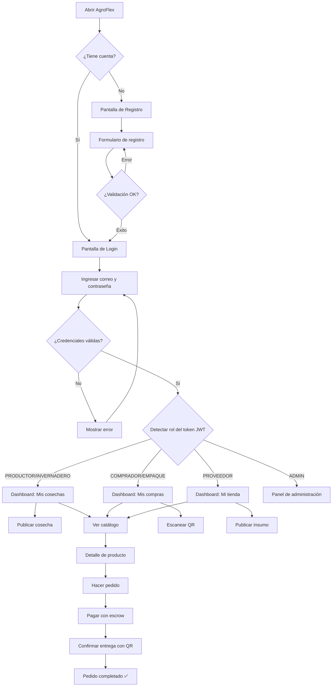
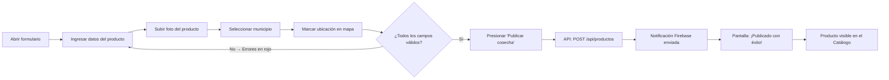
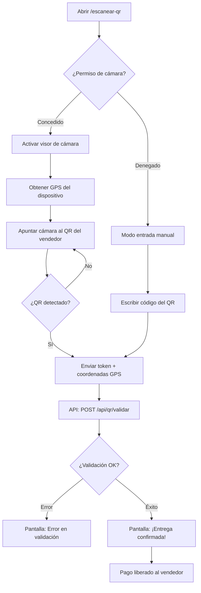

# Manual de Usuario — AgroFlex

> **Marketplace Agrícola Digital · Tepeaca-Acatzingo-Huixcolotla, Puebla, México**

---

## Hoja de Control de Versiones

| Versión | Fecha        | Autor                   | Descripción del cambio                        |
|---------|--------------|-------------------------|-----------------------------------------------|
| 1.0.0   | 25/04/2026   | Equipo AgroFlex         | Versión inicial del manual de usuario         |
| 1.1.0   | —            | —                       | (Reservado para actualizaciones futuras)      |

---

## Tabla de Contenidos

1. [Introducción](#1-introducción)  
   1.1 [¿Qué es AgroFlex?](#11-qué-es-agroflex)  
   1.2 [Beneficios principales](#12-beneficios-principales)  
   1.3 [Perfiles de usuario (roles)](#13-perfiles-de-usuario-roles)  

2. [Requisitos para usar el sistema](#2-requisitos-para-usar-el-sistema)  
   2.1 [Dispositivos compatibles](#21-dispositivos-compatibles)  
   2.2 [Navegadores recomendados](#22-navegadores-recomendados)  
   2.3 [Conexión a internet](#23-conexión-a-internet)  

3. [Primeros pasos — Acceso al sistema](#3-primeros-pasos--acceso-al-sistema)  
   3.1 [Abrir AgroFlex](#31-abrir-agroflex)  
   3.2 [Crear una cuenta nueva](#32-crear-una-cuenta-nueva)  
   3.3 [Iniciar sesión](#33-iniciar-sesión)  
   3.4 [Recuperar contraseña olvidada](#34-recuperar-contraseña-olvidada)  
   3.5 [Cerrar sesión](#35-cerrar-sesión)  

4. [Interfaz general y navegación](#4-interfaz-general-y-navegación)  
   4.1 [Pantalla de inicio (Landing Page)](#41-pantalla-de-inicio-landing-page)  
   4.2 [Barra de navegación (Navbar)](#42-barra-de-navegación-navbar)  
   4.3 [Diagrama de navegación del sistema](#43-diagrama-de-navegación-del-sistema)  
   4.4 [Menú inferior (mobile)](#44-menú-inferior-mobile)  

5. [Funcionalidades según tu rol](#5-funcionalidades-según-tu-rol)  
   5.1 [Explorar el catálogo de productos (todos los roles)](#51-explorar-el-catálogo-de-productos-todos-los-roles)  
   5.2 [Ver el detalle de un producto](#52-ver-el-detalle-de-un-producto)  
   5.3 [Dashboard del Productor / Invernadero](#53-dashboard-del-productor--invernadero)  
   5.4 [Publicar una cosecha](#54-publicar-una-cosecha)  
   5.5 [Editar o gestionar mis cosechas](#55-editar-o-gestionar-mis-cosechas)  
   5.6 [Dashboard del Comprador / Empaque](#56-dashboard-del-comprador--empaque)  
   5.7 [Mis pedidos (Comprador)](#57-mis-pedidos-comprador)  
   5.8 [Escanear QR para confirmar entrega](#58-escanear-qr-para-confirmar-entrega)  
   5.9 [Dashboard del Proveedor de insumos](#59-dashboard-del-proveedor-de-insumos)  
   5.10 [Gestionar mi tienda (Proveedor)](#510-gestionar-mi-tienda-proveedor)  

6. [Perfil y configuración de cuenta](#6-perfil-y-configuración-de-cuenta)  
   6.1 [Ver y editar mi perfil](#61-ver-y-editar-mi-perfil)  
   6.2 [Foto de perfil](#62-foto-de-perfil)  
   6.3 [Configuración general](#63-configuración-general)  
   6.4 [Notificaciones](#64-notificaciones)  

7. [Funcionalidades avanzadas](#7-funcionalidades-avanzadas)  
   7.1 [Filtros avanzados en el catálogo](#71-filtros-avanzados-en-el-catálogo)  
   7.2 [Verificación de vendedor (Insignia)](#72-verificación-de-vendedor-insignia)  
   7.3 [Mapa de geolocalización](#73-mapa-de-geolocalización)  
   7.4 [Perfil público del vendedor](#74-perfil-público-del-vendedor)  
   7.5 [Panel de Administración (solo ADMIN)](#75-panel-de-administración-solo-admin)  

8. [Solución de problemas y preguntas frecuentes](#8-solución-de-problemas-y-preguntas-frecuentes)  
   8.1 [Problemas de acceso](#81-problemas-de-acceso)  
   8.2 [Problemas con el catálogo](#82-problemas-con-el-catálogo)  
   8.3 [Problemas con la cámara / QR](#83-problemas-con-la-cámara--qr)  
   8.4 [Preguntas frecuentes (FAQ)](#84-preguntas-frecuentes-faq)  

9. [Glosario de términos](#9-glosario-de-términos)  

10. [Contacto y soporte](#10-contacto-y-soporte)  

---

## 1. Introducción

### 1.1 ¿Qué es AgroFlex?

AgroFlex es un **marketplace agrícola digital** diseñado para la región de Tepeaca-Acatzingo-Huixcolotla, en el estado de Puebla, México. Su misión es **eliminar a los intermediarios** (conocidos localmente como "coyotes") que históricamente compran las cosechas al productor a precios muy bajos para revenderlas con grandes ganancias.

Con AgroFlex, los agricultores y proveedores de insumos agrícolas pueden publicar sus productos directamente en una plataforma digital accesible desde cualquier teléfono celular, donde compradores reales —como centros de empaque, restaurantes, tiendas y acopiadores— pueden encontrarlos, contactarlos y realizar pedidos con pagos seguros y protegidos.

> El sistema está construido con tecnología moderna: **React.js** en el frontend (interfaz visual) y **Spring Boot / Java** en el backend (servidor), comunicados a través de una arquitectura de microservicios.

---

### 1.2 Beneficios principales

| Beneficio                          | Para quién                        |
|------------------------------------|-----------------------------------|
| Vende tu cosecha al precio justo   | Productores e Invernaderos        |
| Encuentra proveedores de insumos   | Todos los usuarios                |
| Pagos seguros con sistema escrow   | Compradores y Vendedores          |
| Confirma entregas con código QR    | Compradores y Productores         |
| Sin intermediarios                 | Productores y Compradores         |
| Acceso desde celular               | Todos los usuarios                |
| Reputación y verificación oficial  | Vendedores activos                |

---

### 1.3 Perfiles de usuario (roles)

AgroFlex reconoce seis tipos de usuario. Cuando te registras, eliges el rol que mejor describe tu actividad:

| Rol             | ¿Quién es?                                              | ¿Qué puede hacer en AgroFlex?                                      |
|-----------------|---------------------------------------------------------|--------------------------------------------------------------------|
| **PRODUCTOR**   | Agricultor con parcela o campo                          | Publica cosechas, recibe pedidos, valida entregas con QR           |
| **INVERNADERO** | Productor que trabaja en invernadero controlado         | Igual que PRODUCTOR, etiquetado como producción de invernadero     |
| **COMPRADOR**   | Cualquier persona u organización que compra producto    | Explora el catálogo, hace pedidos, paga con escrow, escanea QR     |
| **EMPAQUE**     | Centro de empaque o acopiador regional                  | Igual que COMPRADOR, orientado a volumen                           |
| **PROVEEDOR**   | Vendedor de agroinsumos (semillas, fertilizantes, etc.) | Publica su tienda de insumos, recibe pedidos                       |
| **ADMIN**       | Personal del equipo AgroFlex                            | Gestiona toda la plataforma: usuarios, insignias, disputas, etc.   |

> **Nota:** Tu rol determina qué menús y opciones ves en la aplicación. Si crees que tu rol fue asignado incorrectamente, contacta al soporte de AgroFlex.

---

## 2. Requisitos para usar el sistema

### 2.1 Dispositivos compatibles

AgroFlex es una **Aplicación Web Progresiva (PWA)**, lo que significa que funciona directamente desde el navegador de tu dispositivo, sin necesidad de descargar nada desde ninguna tienda de aplicaciones.

| Dispositivo               | Compatible | Recomendado |
|---------------------------|------------|-------------|
| Teléfono Android          | ✅ Sí       | ✅ Sí        |
| iPhone (iOS 14+)          | ✅ Sí       | ✅ Sí        |
| Tableta Android / iPad    | ✅ Sí       | ✅ Sí        |
| Computadora / Laptop      | ✅ Sí       | ✅ Sí        |

Para la función de **escaneo de QR**, necesitarás un dispositivo con cámara frontal o trasera.

---

### 2.2 Navegadores recomendados

| Navegador               | Versión mínima | Compatibilidad |
|-------------------------|---------------|----------------|
| Google Chrome           | 90+           | ✅ Totalmente compatible |
| Mozilla Firefox         | 88+           | ✅ Totalmente compatible |
| Microsoft Edge          | 91+           | ✅ Totalmente compatible |
| Safari (iPhone/iPad)    | 14+           | ✅ Compatible (con algunas limitaciones de cámara) |
| Opera                   | 76+           | ✅ Compatible |

> **Recomendación:** Usa **Google Chrome** en tu teléfono para la mejor experiencia, especialmente para el escáner de QR.

---

### 2.3 Conexión a internet

AgroFlex requiere conexión a internet activa para funcionar. Las funciones principales (catálogo, publicar, pagar) necesitan buena señal.

| Función                    | Requiere internet |
|----------------------------|------------------|
| Ver el catálogo            | ✅ Sí             |
| Publicar cosecha/insumo    | ✅ Sí             |
| Iniciar/cerrar sesión      | ✅ Sí             |
| Ver mi perfil              | ✅ Sí             |
| Escanear QR                | ✅ Sí (para validar) |

> Velocidad mínima recomendada: **3G** (se pueden presentar imágenes lentas con señal muy débil).

---

## 3. Primeros pasos — Acceso al sistema

### 3.1 Abrir AgroFlex

1. Abre el navegador de tu teléfono o computadora.
2. Escribe la dirección de AgroFlex en la barra de direcciones:  
   **`http://localhost:5173`** *(en entorno local de desarrollo)*  
   o bien la URL de producción que el equipo te haya proporcionado.
3. Verás la **pantalla de inicio (Landing Page)** con información sobre la plataforma.

> [Insertar captura de pantalla aquí: **Pantalla de inicio (Landing Page) de AgroFlex**. La imagen debe mostrar el hero con carrusel de imágenes agrícolas, el botón verde "Explorar catálogo" y el navbar superior con el logo de AgroFlex a la izquierda y los botones "Iniciar sesión" y "Registrarse" a la derecha. Anotaciones sugeridas: flecha señalando el botón "Registrarse" y otra señalando el botón "Iniciar sesión".]

---

### 3.2 Crear una cuenta nueva

Si es tu primera vez usando AgroFlex, necesitas crear una cuenta. El proceso es rápido y gratuito.

**Pasos para registrarte:**

1. Desde la pantalla de inicio, presiona el botón **"Registrarse"** en la esquina superior derecha del navbar.  
   También puedes ir directamente a: `/register`

> [Insertar captura de pantalla aquí: **Botón "Registrarse" en el navbar**. La imagen debe mostrar el navbar con el logo a la izquierda y los botones "Iniciar sesión" y "Registrarse" a la derecha. Anotar con una flecha el botón verde "Registrarse".]

2. Se abrirá el **formulario de registro**. Rellena todos los campos:

   | Campo             | Descripción                                              | Ejemplo                      |
   |-------------------|----------------------------------------------------------|------------------------------|
   | **Nombre**        | Tu nombre de pila                                        | `María`                      |
   | **Apellidos**     | Tus apellidos                                            | `López García`               |
   | **Correo electrónico** | Tu email, que usarás para iniciar sesión           | `maria@ejemplo.com`          |
   | **Teléfono**      | Tu número celular (10 dígitos)                           | `2224567890`                 |
   | **Contraseña**    | Mínimo 8 caracteres, una mayúscula y un número           | `MiClave2026`                |
   | **Confirmar contraseña** | Escribe la misma contraseña para confirmar      | `MiClave2026`                |
   | **Rol**           | Selecciona tu tipo de cuenta del menú desplegable        | `PRODUCTOR`                  |
   | **Municipio**     | Tu municipio de operación                                | `Tepeaca`                    |

> [Insertar captura de pantalla aquí: **Formulario de registro completo con campos visibles**. Mostrar todos los campos mencionados ya rellenados con datos de ejemplo. Anotar con flechas: (1) campo correo electrónico, (2) campo contraseña con el ícono de ojo para mostrar/ocultar, (3) selector de Rol con el menú desplegable abierto mostrando: PRODUCTOR, INVERNADERO, COMPRADOR, EMPAQUE, PROVEEDOR.]

3. Lee los términos y condiciones (si aparece la casilla) y márcala como aceptada.
4. Presiona el botón **"Crear cuenta"** (color verde).
5. Si todo está correcto, verás un mensaje de confirmación y serás redirigido a la pantalla de **inicio de sesión**.

> [Insertar captura de pantalla aquí: **Mensaje de éxito tras el registro**. Mostrar el toast o alerta verde con texto como "¡Cuenta creada exitosamente! Por favor inicia sesión." con una palomita verde.]

**Posibles errores durante el registro:**

| Mensaje de error                                  | Causa                                           | Solución                                        |
|---------------------------------------------------|-------------------------------------------------|-------------------------------------------------|
| "El correo ya está registrado"                    | Ya existe una cuenta con ese email              | Usa otro correo o inicia sesión con ese email   |
| "La contraseña debe tener al menos 8 caracteres" | La contraseña es muy corta                      | Elige una contraseña más larga                  |
| "Las contraseñas no coinciden"                    | Los dos campos de contraseña son diferentes     | Escribe la misma contraseña en ambos campos     |
| "Correo electrónico no válido"                    | El formato del email es incorrecto              | Verifica que el email tenga el formato correcto |

---

### 3.3 Iniciar sesión

Una vez que tienes una cuenta, puedes ingresar a AgroFlex con tus credenciales.

**Pasos para iniciar sesión:**

1. Ve a la pantalla de inicio de AgroFlex y presiona **"Iniciar sesión"** en el navbar, o visita directamente `/login`.

> [Insertar captura de pantalla aquí: **Pantalla de inicio de sesión**. Mostrar el formulario centrado con: campo de correo electrónico, campo de contraseña con botón de ojo, enlace "¿Olvidaste tu contraseña?", y botón grande verde "Iniciar sesión". El fondo debe mostrar el diseño de la app con el logo de AgroFlex arriba. Anotar con flechas los dos campos de datos.]

2. Ingresa tu **correo electrónico** registrado.
3. Ingresa tu **contraseña**.
4. Presiona el botón **"Iniciar sesión"**.
5. Si tus datos son correctos, el sistema detectará tu rol automáticamente y te redirigirá a tu **panel de control** correspondiente:

   | Tu rol              | A dónde te lleva tras el login         |
   |---------------------|----------------------------------------|
   | PRODUCTOR / INVERNADERO | `/mis-cosechas` (Mis cosechas)     |
   | COMPRADOR / EMPAQUE     | `/mis-compras` (Mis compras)       |
   | PROVEEDOR               | `/mi-tienda` (Mi tienda)           |
   | ADMIN                   | `/admin/dashboard` (Panel admin)   |

> [Insertar captura de pantalla aquí: **Pantalla de bienvenida post-login** para un usuario PRODUCTOR. Mostrar el dashboard con header verde con "Mis cosechas", las estadísticas rápidas (Disponibles / Reservadas / En tránsito) y el estado vacío animado si no hay cosechas publicadas aún. Anotar con flechas: (1) saludo personalizado con el nombre del usuario, (2) tarjetas de estadísticas.]

**Posibles errores al iniciar sesión:**

| Mensaje de error                            | Causa                                          | Solución                                        |
|---------------------------------------------|------------------------------------------------|-------------------------------------------------|
| "Credenciales incorrectas"                  | Email o contraseña equivocados                 | Verifica que estés escribiendo bien tus datos   |
| "Usuario no encontrado"                     | No hay cuenta con ese correo                   | Verifica el correo o crea una cuenta nueva      |
| "Error de conexión"                         | El servidor no responde                        | Espera unos segundos y vuelve a intentar        |

---

### 3.4 Recuperar contraseña olvidada

Si olvidaste tu contraseña, puedes restablecerla fácilmente:

**Pasos:**

1. En la pantalla de inicio de sesión, presiona el enlace **"¿Olvidaste tu contraseña?"** que aparece debajo del campo de contraseña.

> [Insertar captura de pantalla aquí: **Enlace "¿Olvidaste tu contraseña?"**. Mostrar el formulario de login con una flecha señalando el enlace azul de recuperación de contraseña, ubicado justo debajo del campo de contraseña y antes del botón de "Iniciar sesión".]

2. Se abrirá la pantalla **"Recuperar contraseña"** (`/forgot-password`).
3. Escribe el **correo electrónico** con el que te registraste.
4. Presiona **"Enviar enlace de recuperación"**.
5. Revisa tu bandeja de entrada: recibirás un email con un enlace para restablecer tu contraseña. El enlace tiene validez de **1 hora**.
6. Al hacer clic en el enlace del correo, serás llevado a la pantalla **"Nueva contraseña"** (`/reset-password`).
7. Escribe tu **nueva contraseña** (mínimo 8 caracteres, una mayúscula y un número) y confírmala.
8. Presiona **"Guardar nueva contraseña"**.
9. Serás redirigido a la pantalla de inicio de sesión. Ya puedes ingresar con tu nueva contraseña.

> [Insertar captura de pantalla aquí: **Pantalla de "Recuperar contraseña"**. Mostrar el formulario con el campo de email, el botón "Enviar enlace" y el mensaje de éxito que dice "Revisa tu correo. Te hemos enviado las instrucciones." con un ícono de sobre de correo.]

> **Importante:** Si no recibes el correo en 5 minutos, revisa tu carpeta de **Spam o Correo no deseado**. Si el problema persiste, contacta al soporte.

---

### 3.5 Cerrar sesión

Para cerrar tu sesión de forma segura:

1. En el navbar (barra de navegación), presiona tu **foto de perfil** o el ícono de usuario en la esquina superior derecha.
2. En el menú desplegable que aparece, selecciona **"Cerrar sesión"**.
3. Serás redirigido a la pantalla de inicio de sesión.

> **Buena práctica:** Cierra siempre tu sesión cuando uses AgroFlex en un dispositivo compartido (computadora del trabajo, celular prestado).

---

## 4. Interfaz general y navegación

### 4.1 Pantalla de inicio (Landing Page)

La **Landing Page** (`/`) es la primera pantalla que ves si no has iniciado sesión. Está dividida en las siguientes secciones:

| # | Sección              | ¿Qué muestra?                                                              |
|---|----------------------|----------------------------------------------------------------------------|
| 1 | **Hero / Carrusel**  | Imágenes llamativas de productos agrícolas y el mensaje principal de AgroFlex |
| 2 | **Cómo funciona**    | 4 pasos explicados visualmente: regístrate → publica / busca → conecta → cobra |
| 3 | **Para quién es**    | Tarjetas de roles: Productor, Comprador, Proveedor                        |
| 4 | **Confianza**        | Señales de confianza: pagos seguros, sin intermediarios, soporte          |
| 5 | **Galería**          | Fotos reales de productos agrícolas de la región                          |
| 6 | **CTA Final**        | Botón grande "Empieza gratis" para invitar al registro                    |
| 7 | **Footer**           | Links útiles, información de contacto, redes sociales                     |

> [Insertar captura de pantalla aquí: **Vista completa de la Landing Page** (scroll completo o collage de secciones). Mostrar el hero con carrusel en la parte superior, la sección "Cómo funciona" con los 4 íconos de pasos, y las tarjetas de roles para Productor, Comprador y Proveedor. Anotar con etiquetas cada sección.]

---

### 4.2 Barra de navegación (Navbar)

El **navbar** es el menú que aparece fijo en la parte superior de la pantalla. Su contenido cambia según si has iniciado sesión o no.

**Navbar sin sesión iniciada:**

```
[Logo AgroFlex]                    [Iniciar sesión]  [Registrarse]
```

**Navbar con sesión iniciada:**

```
[Logo AgroFlex]  [Catálogo]  [Mi Dashboard]    [Notificaciones 🔔]  [Mi perfil 👤▼]
```

Al presionar **"Mi perfil"**, aparece un menú desplegable con:
- Ver mi perfil
- Configuración
- Cerrar sesión

> [Insertar captura de pantalla aquí: **Navbar con sesión activa**. Mostrar la barra de navegación completa con el logo de AgroFlex en verde a la izquierda, los enlaces de menú en el centro, y el ícono de notificaciones y el avatar del usuario a la derecha. Anotar con flechas: (1) logo, (2) enlace "Catálogo", (3) ícono de notificaciones con badge rojo si hay nuevas, (4) avatar del usuario con flecha desplegable.]

---

### 4.3 Diagrama de navegación del sistema

A continuación encontrarás el **mapa completo de navegación de AgroFlex**, organizado por rol de usuario. Este diagrama te ayuda a entender qué secciones existen y cómo llegar a cada una desde el punto de inicio.

#### Árbol jerárquico de navegación

```
AgroFlex (/)
│
├── 📄 Landing Page (/)
│   ├── [No autenticado] → Iniciar sesión (/login)
│   └── [No autenticado] → Registrarse (/register)
│
├── 🔐 Autenticación
│   ├── Login (/login)
│   ├── Registro (/register)
│   ├── Recuperar contraseña (/forgot-password)
│   └── Nueva contraseña (/reset-password?token=...)
│
├── 🌾 PRODUCTOR / INVERNADERO
│   ├── Mis cosechas — Dashboard (/mis-cosechas)
│   │   ├── Ver lotes publicados
│   │   ├── Filtrar por estado (Disponibles / Reservadas / En escrow)
│   │   └── Acciones rápidas
│   ├── Publicar cosecha (/publicar-lote?type=cosechas)
│   │   ├── Formulario de publicación
│   │   ├── Subida de imagen
│   │   └── Selector de ubicación en mapa
│   ├── Editar cosecha (/mis-cosechas/:id/editar)
│   ├── Catálogo público (/catalog)
│   ├── Detalle de producto (/catalog/:id)
│   ├── Mapa (/mapa)
│   ├── Notificaciones (/notificaciones)
│   └── Mi perfil (/perfil)
│       └── Verificar insignia (/verify-badge)
│
├── 🛒 COMPRADOR / EMPAQUE
│   ├── Mis compras — Dashboard (/mis-compras)
│   │   ├── Ver pedidos activos
│   │   └── Filtrar por estado (Pendientes / En camino / Completados)
│   ├── Mis pedidos (/mis-pedidos)
│   │   └── Detalle de pedido (/mis-pedidos/:orderId)
│   │       └── Pagar orden (/pagar/:orderId)
│   ├── Escanear QR (/escanear-qr)
│   │   ├── Modo cámara (html5-qrcode)
│   │   └── Entrada manual de código
│   ├── Mi QR (/mi-qr/:orderId)
│   ├── Catálogo público (/catalog)
│   ├── Detalle de producto (/catalog/:id)
│   ├── Notificaciones (/notificaciones)
│   └── Mi perfil (/perfil)
│
├── 🧪 PROVEEDOR (Agroinsumos)
│   ├── Mi tienda — Dashboard (/mi-tienda)
│   │   ├── Ver insumos publicados
│   │   └── Gestionar inventario
│   ├── Publicar insumo (/publicar-lote?type=insumos)
│   ├── Catálogo público (/catalog)
│   ├── Notificaciones (/notificaciones)
│   └── Mi perfil (/perfil)
│
├── 🛡️ ADMIN
│   ├── Dashboard Admin (/admin/dashboard)
│   │   ├── Métricas: usuarios, productos, insignias, disputas
│   │   └── Actividad reciente
│   ├── Gestión de usuarios (/admin/usuarios)
│   │   └── Detalle de usuario (/admin/usuarios/:id)
│   ├── Insignias pendientes (/admin/insignias)
│   ├── Catálogo Admin (/admin/catalogo)
│   ├── Pedidos Admin (/admin/pedidos)
│   ├── Disputas (/admin/disputas)
│   ├── Transacciones (/admin/transacciones)
│   ├── Monitor de servicios (/admin/health)
│   └── Mensajes broadcast (/admin/broadcast)
│
└── 🌐 Páginas públicas (sin login)
    ├── Catálogo público (/catalog) — Solo lectura
    ├── Detalle de producto (/catalog/:id)
    ├── Perfil público de vendedor (/vendedor/:id)
    └── Mapa (/mapa)
```

#### Diagrama Mermaid — Flujo principal del usuario



> [Insertar captura de pantalla aquí: **Renderizado del diagrama Mermaid anterior** como imagen generada, mostrando el flujo completo desde "Abrir AgroFlex" hasta "Pedido completado", con los nodos en colores verde y blanco. Incluir este diagrama como imagen en la versión PDF del manual.]

---

### 4.4 Menú inferior (mobile)

En dispositivos móviles, AgroFlex muestra una **barra de navegación inferior** fija que da acceso rápido a las secciones principales. El contenido varía según tu rol:

**Para PRODUCTOR:**
```
[🏠 Inicio]  [📦 Catálogo]  [➕ Publicar]  [🔔 Alertas]  [👤 Perfil]
```

**Para COMPRADOR:**
```
[🏠 Inicio]  [📦 Catálogo]  [🛒 Pedidos]  [📷 QR]  [👤 Perfil]
```

**Para PROVEEDOR:**
```
[🏠 Inicio]  [📦 Catálogo]  [🏪 Tienda]  [🔔 Alertas]  [👤 Perfil]
```

> [Insertar captura de pantalla aquí: **Barra inferior de navegación mobile** para el rol PRODUCTOR. Mostrar los 5 íconos alineados horizontalmente en la parte baja de la pantalla sobre fondo blanco. El ícono activo (por ejemplo "Catálogo") debe estar resaltado en verde. Anotar con etiquetas cada ícono y su función.]

---

## 5. Funcionalidades según tu rol

### 5.1 Explorar el catálogo de productos (todos los roles)

El **catálogo** (`/catalog`) es la sección central de AgroFlex. Aquí puedes ver todos los productos agrícolas disponibles: cosechas frescas y suministros agrícolas publicados por productores y proveedores.

> **Acceso:** Puedes ver el catálogo incluso sin haber iniciado sesión. Sin embargo, para hacer pedidos necesitas estar autenticado.

**Cómo navegar el catálogo:**

1. Presiona el enlace **"Catálogo"** en el navbar superior o el ícono de catálogo en el menú inferior.
2. Verás una cuadrícula de tarjetas de productos.

> [Insertar captura de pantalla aquí: **Pantalla principal del Catálogo** (`/catalog`). Mostrar la cuadrícula de 2 columnas con tarjetas de productos agrícolas (cosechas y suministros). Cada tarjeta debe mostrar: imagen del producto, nombre, precio, unidad de venta, ubicación (municipio) y el badge de tipo (cosecha/insumo). Anotar: (1) la barra de búsqueda en la parte superior, (2) los chips de filtro rápido "Todos / Cosechas / Suministros", (3) una tarjeta de producto con sus elementos señalados.]

3. Si tienes sesión activa, verás en la parte superior un **saludo personalizado** con tu nombre y 3 métricas rápidas: lotes activos, pedidos y reputación.

**Barra de búsqueda:**

- En la parte superior de la pantalla verás una barra de búsqueda con el texto "Buscar producto o municipio...".
- Escribe el nombre del producto que buscas (por ejemplo: `tomate`, `semillas`, `maíz`) o el nombre del municipio.
- Los resultados se actualizan automáticamente mientras escribes.

> [Insertar captura de pantalla aquí: **Barra de búsqueda activa** en el catálogo. Mostrar el campo con el texto "tomate" escrito y los resultados filtrados abajo mostrando solo tarjetas de tomate. Anotar con flecha el campo de búsqueda.]

**Chips de filtro rápido:**

| Chip            | ¿Qué muestra?                                     |
|-----------------|---------------------------------------------------|
| **Todos**       | Cosechas y suministros mezclados                  |
| **Cosechas**    | Solo productos cosechados (verduras, frutas, etc.)|
| **Suministros** | Solo agroinsumos (semillas, fertilizantes, etc.)  |

**Ordenar resultados:**

Usa los chips de ordenamiento para organizar los productos:

| Opción           | Descripción                                       |
|------------------|---------------------------------------------------|
| **Recientes**    | Primero los publicados más recientemente          |
| **Menor precio** | De más barato a más caro                          |
| **Mayor precio** | De más caro a más barato                          |

**Cargar más resultados:**

- Al llegar al final de la página, verás el botón **"Cargar más"**.
- Presiónalo para ver más productos (paginación infinita).

> [Insertar captura de pantalla aquí: **Botón "Cargar más"** al final de la lista de productos. Mostrar el botón centrado con el ícono de carga y el texto "Cargar más productos".]

---

### 5.2 Ver el detalle de un producto

Desde el catálogo, puedes ver la información completa de cualquier producto:

1. Presiona sobre la **tarjeta del producto** que te interesa.
2. Serás llevado a la pantalla de **Detalle del producto** (`/catalog/:id`).
3. Aquí verás:

> [Insertar captura de pantalla aquí: **Pantalla de Detalle de producto**. Mostrar la imagen grande del producto en la parte superior, seguida del nombre del producto, precio por kg/pieza, descripción detallada, municipio de origen, cantidad disponible, datos de contacto del vendedor y el botón "Hacer pedido" en verde al final. Anotar: (1) imagen del producto, (2) precio destacado, (3) botón de pedido, (4) sección de información del vendedor.]

| Información visible             | Descripción                                      |
|---------------------------------|--------------------------------------------------|
| **Nombre del producto**         | Ej: "Tomate Bola - Lote 4"                       |
| **Tipo**                        | Cosecha o Suministro                             |
| **Precio**                      | Precio por unidad de venta (kg, pieza, caja)     |
| **Cantidad disponible**         | Cuántos kg / piezas / cajas hay disponibles      |
| **Descripción**                 | Detalles del productor sobre la calidad, etc.    |
| **Municipio de origen**         | Dónde está el producto                           |
| **Contacto del vendedor**       | Nombre y teléfono del publicante                 |
| **Mapa de ubicación**           | Mapa interactivo con la ubicación aproximada     |
| **Reseñas del vendedor**        | Calificaciones y comentarios anteriores          |
| **Botón "Hacer pedido"**        | Para iniciar la compra (requiere sesión)         |

4. Si quieres contactar directamente al vendedor, puedes ver su nombre y número en la sección de contacto.
5. Para ver el perfil público del vendedor, presiona su nombre.

---

### 5.3 Dashboard del Productor / Invernadero

Cuando inicias sesión como **PRODUCTOR** o **INVERNADERO**, tu pantalla principal es **"Mis cosechas"** (`/mis-cosechas`). Este es tu panel de control para gestionar todo lo que publicas.

> [Insertar captura de pantalla aquí: **Dashboard del Productor** (`/mis-cosechas`). Mostrar la cabecera verde con gradiente que dice "Mis cosechas" y el número de publicaciones activas. Abajo, las 3 tarjetas de estadísticas: "Disponibles", "Reservadas", "En tránsito". Debajo, los chips de filtro y la lista de cosechas (o el estado vacío si no hay ninguna). Anotar: (1) sección de encabezado, (2) estadísticas, (3) chips de filtro, (4) estado vacío con botón "Publicar mi primera cosecha".]

**Elementos del dashboard:**

- **Encabezado verde:** Muestra tu rol (Productor o Invernadero), el número de publicaciones activas y las estadísticas en mini-tarjetas.
- **Chips de filtro:** `Todas | Disponibles | Reservadas | En escrow`
- **Lista de cosechas:** Cada cosecha publicada aparece como una tarjeta con:
  - Emoji del cultivo + nombre del producto
  - Precio y unidad
  - Estado (badge de color): Disponible 🟢, Reservado 🟡, En escrow 🔵
  - Municipio
  - Botón de editar

**Botón flotante "+" (FAB):**

- En la esquina inferior derecha de la pantalla encontrarás un botón redondo verde con el símbolo **"+"**.
- Al presionarlo, se despliegan las opciones: **"Publicar cosecha"** y **"Publicar insumo"** (según tu rol).

> [Insertar captura de pantalla aquí: **Botón FAB desplegado** en el Dashboard del Productor. Mostrar el botón redondo verde con el "+" en la esquina inferior derecha y las dos opciones que aparecen al presionarlo: "Publicar cosecha" y "Publicar insumo", cada una con su ícono.]

---

### 5.4 Publicar una cosecha

Publicar tu cosecha en AgroFlex es el paso más importante para que los compradores te encuentren.

**Pasos para publicar:**

1. Desde tu **Dashboard** o desde el **botón FAB** en el catálogo, presiona **"Publicar cosecha"**.  
   O navega directamente a: `/publicar-lote?type=cosechas`

> [Insertar captura de pantalla aquí: **Pantalla "Publicar cosecha"** (`/publicar-lote`). Mostrar el formulario con el encabezado con gradiente verde y el título "Publicar cosecha". Los campos visibles: Nombre del producto, Descripción, Precio, Cantidad disponible, Unidad de venta (selector), Municipio. Anotar: (1) barra de progreso o indicador de pasos si existe, (2) campo de nombre de producto, (3) selector de unidad de venta con las opciones: kg, tonelada, pieza, caja, saco, litro.]

2. **Rellena el formulario** con la información de tu cosecha:

   | Campo                  | ¿Qué poner?                                                         | Ejemplo                          |
   |------------------------|---------------------------------------------------------------------|----------------------------------|
   | **Nombre del producto**| El nombre del cultivo                                               | `Tomate Bola`                    |
   | **Descripción**        | Detalles sobre la calidad, variedad, cómo fue cultivado            | `Tomate cultivado sin agroquímicos en Tepeaca. Calibre mediano.` |
   | **Precio**             | Precio por unidad de venta que defines tú                           | `8.50`                           |
   | **Cantidad disponible**| Cuánto tienes disponible en la unidad elegida                       | `500`                            |
   | **Unidad de venta**    | En qué unidad vendes (kg, tonelada, pieza, caja, saco, litro)       | `kg`                             |
   | **Municipio**          | Selecciona el municipio donde está el producto                      | `Tepeaca`                        |
   | **Teléfono de contacto**| Tu número para que te llamen                                       | `2224567890`                     |
   | **Foto del producto**  | Sube una foto real de tu cosecha                                    | [Archivo .jpg o .png, máx. 2 MB] |
   | **Ubicación en mapa**  | Arrastra el marcador para indicar la ubicación exacta               | (Interactivo en el mapa)         |

3. **Subir foto del producto:**
   - Presiona el área de carga de imágenes (ícono de cámara o nube).
   - Selecciona una foto desde tu galería o toma una foto en ese momento.
   - La imagen debe ser en formato JPG o PNG y pesar menos de 2 MB.
   - Verás la vista previa de la imagen antes de publicar.

> [Insertar captura de pantalla aquí: **Sección de carga de imagen** en el formulario de publicación. Mostrar el cuadro de carga con ícono de cámara, el texto "Toca para subir foto" y la vista previa de una imagen de tomates ya cargada. Anotar: (1) zona de clic para seleccionar imagen, (2) vista previa de la imagen, (3) botón "Cambiar foto".]

4. **Seleccionar ubicación en el mapa:**
   - Verás un mapa interactivo de la región.
   - Arrastra el marcador o toca sobre el mapa para indicar exactamente dónde está tu producto.
   - Esto ayuda a los compradores a calcular distancias.

> [Insertar captura de pantalla aquí: **Selector de ubicación en mapa** dentro del formulario. Mostrar el mapa de la región Tepeaca-Acatzingo con un marcador verde en una parcela. Anotar: (1) el marcador arrastrable, (2) las coordenadas de latitud/longitud que aparecen debajo del mapa.]

5. Una vez que hayas llenado todos los campos obligatorios (marcados con *), presiona el botón **"Publicar cosecha"** en la parte inferior de la pantalla.

6. Verás una pantalla de **confirmación de éxito** con un checkmark verde. Tu cosecha ya es visible en el catálogo para todos los compradores.

> [Insertar captura de pantalla aquí: **Pantalla de éxito tras publicar cosecha**. Mostrar el ícono grande de checkmark verde con el texto "¡Cosecha publicada!" y el subtítulo "Ya está visible en el catálogo. Los compradores podrán contactarte." Anotar el botón "Ver en catálogo" y el botón "Publicar otra".]

**Diagrama de flujo: Proceso de publicación de cosecha**



---

### 5.5 Editar o gestionar mis cosechas

Si necesitas actualizar la información de una cosecha ya publicada (cambiar el precio, actualizar la cantidad disponible, etc.):

1. Ve a tu **Dashboard** (`/mis-cosechas`).
2. Localiza la cosecha que deseas editar en la lista.
3. Presiona el ícono de **lápiz** (✏️) o el botón **"Editar"** que aparece en la tarjeta.
4. Serás llevado al formulario de edición (`/mis-cosechas/:id/editar`).
5. Modifica los campos que necesites actualizar.
6. Presiona **"Guardar cambios"**.

> [Insertar captura de pantalla aquí: **Tarjeta de cosecha con botón "Editar"**. Mostrar una tarjeta de producto (tomate bola) con el ícono de lápiz claramente visible. Anotar el botón de edición con una flecha.]

> **Nota:** Los cambios en precio y cantidad son inmediatos. Los compradores que estén viendo el catálogo verán la información actualizada de inmediato.

---

### 5.6 Dashboard del Comprador / Empaque

Cuando inicias sesión como **COMPRADOR** o **EMPAQUE**, tu pantalla principal es **"Mis compras"** (`/mis-compras`).

> [Insertar captura de pantalla aquí: **Dashboard del Comprador** (`/mis-compras`). Mostrar la cabecera verde más clara con el título "Mis compras" y las estadísticas: Pendientes, En camino, Completadas. Abajo los chips de filtro y el estado vacío con el ícono de bolsa y el botón "Explorar catálogo". Anotar: (1) estadísticas en mini-tarjetas, (2) chips de filtro, (3) estado vacío.]

**Elementos del dashboard:**

- **Estadísticas de pedidos:** Mini-tarjetas que muestran cuántos pedidos tienes por estado.
- **Chips de filtro:** `Todos | Pendientes | En camino | Completados`
- **Lista de pedidos:** Cada pedido aparece con:
  - Nombre del producto y del vendedor
  - Fecha del pedido
  - Estado: Pendiente 🟡, En camino 🔵, Listo para entrega 🟢, Completado ✅
  - Precio total
  - Botón para ver detalles

- **Acceso rápido al catálogo:** Si no tienes pedidos, verás el botón **"Explorar catálogo"** para comenzar a comprar.

---

### 5.7 Mis pedidos (Comprador)

La sección **"Mis pedidos"** (`/mis-pedidos`) muestra el listado detallado de todos tus pedidos, con opciones de seguimiento y pago.

**Ver el detalle de un pedido:**

1. Desde el Dashboard o desde `/mis-pedidos`, presiona sobre cualquier pedido.
2. Serás llevado al detalle del pedido (`/mis-pedidos/:orderId`).

> [Insertar captura de pantalla aquí: **Detalle de un pedido activo**. Mostrar la pantalla con: número de pedido, nombre del producto, imagen, vendedor, cantidad, precio unitario, subtotal, fecha de pedido, estado actual con el progreso visual (barra de 4 pasos: Confirmado → Preparando → En camino → Entregado), datos del vendedor, y el botón "Confirmar entrega con QR" en verde si el pedido está en estado "En camino". Anotar: (1) la barra de progreso del pedido, (2) el botón de confirmar entrega.]

**Estados de un pedido:**

| Estado               | Significado                                             | Qué debes hacer tú                         |
|----------------------|---------------------------------------------------------|--------------------------------------------|
| **PENDIENTE**        | El vendedor aún no ha confirmado el pedido              | Esperar                                    |
| **PREPARANDO**       | El vendedor está preparando tu pedido                   | Esperar                                    |
| **EN_CAMINO**        | El producto está en camino hacia ti                     | Esperar y prepararte para recibirlo        |
| **LISTO_ENTREGA**    | El producto ya llegó / está listo para recoger          | Confirmar la entrega escaneando el QR      |
| **COMPLETADO**       | Entrega confirmada y pago liberado al vendedor          | Puedes dejar una reseña                    |
| **CANCELADO**        | El pedido fue cancelado                                 | Si fue un error, contacta al soporte       |

---

### 5.8 Escanear QR para confirmar entrega

El **escáner de QR** es una de las funciones más importantes de AgroFlex. Cuando recibes tu producto, el vendedor te muestra un código QR en su teléfono. Tú lo escaneas para confirmar que recibiste el pedido y liberar el pago al vendedor de forma automática.

**Pasos para escanear el QR:**

1. Desde el menú inferior, presiona el ícono de **"QR"** o **"Confirmar entrega"**.  
   O navega a `/escanear-qr`.

2. La pantalla te pedirá **permiso para usar la cámara**. Presiona **"Permitir"** o **"Dar permiso"**.

> [Insertar captura de pantalla aquí: **Pantalla de solicitud de permiso de cámara** en AgroFlex. Mostrar el panel con el ícono de cámara, el texto "Necesitamos acceso a tu cámara para escanear el código QR del vendedor" y el botón verde "Dar permiso". Anotar el botón con una flecha.]

3. Una vez concedido el permiso, se activará el **visor de la cámara**. Verás un recuadro de enfoque.
4. Apunta la cámara de tu teléfono al **código QR** que te muestra el vendedor en su dispositivo.
5. El sistema leerá el QR automáticamente en cuanto esté dentro del recuadro.
6. Verás el mensaje **"Validando entrega..."** durante unos segundos.
7. Si la validación es exitosa, aparecerá la pantalla de **"Entrega confirmada"** con detalles del pedido.

> [Insertar captura de pantalla aquí: **Visor de cámara activo** en la pantalla de escaneo. Mostrar la vista de cámara con el recuadro de enfoque animado en el centro y el texto "Apunta al código QR del vendedor" debajo. En la parte superior, el botón "Volver". Anotar: (1) el recuadro de enfoque animado, (2) el ícono GPS en la esquina superior derecha indicando que la geolocalización está activa.]

8. Opcionalmente, si tu cámara no funciona o no puedes escanear, presiona **"Ingresar código manual"** para escribir el código alfanumérico del QR a mano.

> [Insertar captura de pantalla aquí: **Pantalla de resultado exitoso** tras el escaneo QR. Mostrar el ícono grande de palomita verde, el texto "¡Entrega confirmada!" en verde y los detalles del pedido confirmado (producto, vendedor, fecha, hora). El botón "Volver a mis pedidos" en la parte inferior. Anotar: (1) el ícono de éxito, (2) los detalles del pedido confirmado, (3) el mensaje "Pago liberado al vendedor".]

**Diagrama de flujo: Escaneo QR**



---

### 5.9 Dashboard del Proveedor de insumos

Cuando inicias sesión como **PROVEEDOR**, tu pantalla principal es **"Mi tienda"** (`/mi-tienda`). Aquí gestionas todos los insumos agrícolas que ofreces (semillas, fertilizantes, herramientas, pesticidas, etc.).

> [Insertar captura de pantalla aquí: **Dashboard del Proveedor** (`/mi-tienda`). Mostrar la cabecera con gradiente verde oscuro con el título "Mi tienda", el subtítulo con el nombre del proveedor y las estadísticas de productos publicados. La lista de insumos con tarjetas que muestran imagen, nombre, precio, unidad y estado. Anotar: (1) contador de productos publicados, (2) botón "+" para agregar nuevo insumo.]

**Elementos del dashboard:**

- **Encabezado:** Nombre de tu tienda o negocio y número de productos publicados.
- **Lista de insumos:** Cada insumo aparece con imagen, nombre, precio, unidad y estado.
- **Botón "+" (FAB):** Para publicar un nuevo insumo rápidamente.

---

### 5.10 Gestionar mi tienda (Proveedor)

1. Ve a tu Dashboard (`/mi-tienda`).
2. Verás todos tus insumos publicados en forma de lista.
3. Puedes **editar** un insumo presionando el ícono de lápiz.
4. Puedes **desactivar** un insumo (para que no aparezca en el catálogo) sin borrarlo.
5. Para **publicar un nuevo insumo**, presiona el botón **"+"** y sigue los mismos pasos que para publicar una cosecha (ver sección 5.4), pero seleccionando el tipo **"Insumo"** en el formulario.

---

## 6. Perfil y configuración de cuenta

### 6.1 Ver y editar mi perfil

Tu perfil en AgroFlex contiene tu información personal, tu reputación y tus insignias de verificación.

**Cómo acceder a tu perfil:**

1. Presiona el ícono de usuario 👤 en el navbar superior o en el menú inferior.
2. Selecciona **"Mi perfil"** del menú desplegable.
3. O navega directamente a `/perfil`.

> [Insertar captura de pantalla aquí: **Pantalla de Perfil del usuario** (`/perfil`). Mostrar la foto de perfil circular en la parte superior, el nombre completo, el rol con su badge de color (ej. "PRODUCTOR" en verde), la descripción personal, y las secciones de: datos personales (email, teléfono, municipio), insignias obtenidas, y el widget de reseñas. Anotar: (1) foto de perfil con ícono de cámara para editarla, (2) badge de rol, (3) sección de insignias, (4) calificación promedio.]

**Información que puedes editar:**

| Campo              | Descripción                                              |
|--------------------|----------------------------------------------------------|
| **Nombre**         | Tu nombre de pila                                        |
| **Apellidos**      | Tus apellidos                                            |
| **Teléfono**       | Tu número celular de contacto                            |
| **Dirección**      | Tu dirección aproximada de operación                     |
| **Estado**         | Estado de la república donde operas                      |
| **Municipio**      | Tu municipio principal de operación                      |
| **Descripción**    | Una presentación breve de ti o tu negocio (máx. 500 caracteres) |
| **Foto de perfil** | Tu foto personal o logo de tu negocio                    |

**Cómo editar tus datos:**

1. En la pantalla de perfil, presiona el botón **"Editar"** o el ícono de lápiz ✏️.
2. Los campos se vuelven editables.
3. Modifica la información que deseas cambiar.
4. Presiona **"Guardar cambios"**.
5. Verás el mensaje de confirmación: "Perfil actualizado correctamente".

> [Insertar captura de pantalla aquí: **Perfil en modo edición**. Mostrar los campos en modo input editables con bordes verdes, el campo de descripción con un textarea, y los botones "Guardar cambios" (verde) y "Cancelar" (gris) al final del formulario. Anotar: (1) campo de nombre en modo edición, (2) campo de descripción, (3) botones de guardar y cancelar.]

---

### 6.2 Foto de perfil

Tu foto de perfil es lo primero que verán los compradores cuando visiten tu perfil público.

**Cómo cambiar tu foto:**

1. En la pantalla de perfil, presiona sobre tu **foto actual** o sobre el ícono de cámara 📷 que aparece sobre ella.
2. Se abrirá el selector de archivos de tu dispositivo.
3. Selecciona una imagen en formato **JPG, PNG o WebP** que pese menos de **2 MB**.
4. Verás la vista previa de la nueva foto.
5. Presiona **"Subir foto"** para confirmar el cambio.

> [Insertar captura de pantalla aquí: **Pantalla de cambio de foto de perfil**. Mostrar la foto de perfil actual con un ícono de cámara superpuesto, el selector de archivos abierto (si es posible mostrarlo), y la vista previa de la nueva imagen seleccionada con los botones "Subir foto" y "Cancelar". Anotar: (1) ícono de cámara sobre la foto, (2) vista previa, (3) botón de subir.]

**Recomendaciones para tu foto:**
- Usa una foto clara y bien iluminada.
- Si eres agricultor, puedes usar una foto tuya en el campo.
- Si eres proveedor, considera usar el logo de tu negocio.
- Evita fotos borrosas, de baja resolución o con texto ilegible.

---

### 6.3 Configuración general

En la pantalla de **Configuración** (`/configuracion`) puedes ajustar preferencias de la aplicación.

**Cómo acceder:**
1. Presiona el ícono de usuario 👤 en el navbar.
2. Selecciona **"Configuración"** del menú.

**Opciones disponibles:**

| Opción                          | Descripción                                               |
|---------------------------------|-----------------------------------------------------------|
| **Cambiar contraseña**          | Actualiza tu contraseña de acceso                         |
| **Preferencias de notificaciones** | Activa/desactiva alertas por email o SMS               |
| **Idioma**                      | Selecciona el idioma de la interfaz (Español por defecto) |
| **Modo oscuro** *(próximamente)*| Cambiar el tema visual de la aplicación                   |

---

### 6.4 Notificaciones

La pantalla de **Notificaciones** (`/notificaciones`) muestra alertas en tiempo real sobre actividades importantes en tu cuenta.

**Tipos de notificaciones:**

| Tipo                                  | ¿Quién la recibe?                  |
|---------------------------------------|------------------------------------|
| "Nuevo pedido recibido"               | PRODUCTOR / PROVEEDOR              |
| "Tu pedido fue confirmado"            | COMPRADOR                          |
| "Tu pedido está en camino"            | COMPRADOR                          |
| "Producto listo para entrega"         | COMPRADOR                          |
| "Nuevo producto en tu zona"           | COMPRADOR / EMPAQUE                |
| "Tu insignia fue aprobada"            | Cualquier vendedor                 |
| "Reseña recibida"                     | PRODUCTOR / PROVEEDOR              |

> [Insertar captura de pantalla aquí: **Pantalla de Notificaciones** (`/notificaciones`). Mostrar la lista de notificaciones con íconos distintos por tipo (campana para alertas, paquete para pedidos, estrella para reseñas), cada una con el texto, el tiempo transcurrido ("Hace 2 horas") y el indicador azul de "no leída". Anotar: (1) indicador de no leída, (2) tipo de notificación, (3) tiempo transcurrido.]

---

## 7. Funcionalidades avanzadas

### 7.1 Filtros avanzados en el catálogo

Además de los chips de filtro rápido, el catálogo tiene un panel de **Filtros Avanzados** que te permite hacer búsquedas muy precisas.

**Cómo acceder:**
1. En el catálogo (`/catalog`), presiona el ícono de **filtros** (embudo o deslizadores) que aparece junto a la barra de búsqueda.
2. Se abrirá el panel de Filtros Avanzados desde la parte inferior de la pantalla (bottom sheet).

> [Insertar captura de pantalla aquí: **Panel de Filtros Avanzados** abierto. Mostrar el panel desplegado desde abajo con las opciones: Tipo de producto (Todos / Cosecha / Suministro), Municipio (selector desplegable), Rango de precio (dos campos numéricos: mínimo y máximo), Ordenar por (selector). Al fondo, los botones "Limpiar filtros" y "Aplicar filtros". Anotar: (1) selector de municipio, (2) campos de rango de precio, (3) botones de acción.]

**Opciones de filtro avanzado:**

| Filtro             | ¿Qué hace?                                                              |
|--------------------|-------------------------------------------------------------------------|
| **Tipo**           | Filtra entre Cosechas, Suministros o Todos                             |
| **Municipio**      | Muestra solo productos de ese municipio                                 |
| **Precio mínimo**  | Excluye productos por debajo de ese precio                              |
| **Precio máximo**  | Excluye productos por encima de ese precio                              |
| **Ordenar por**    | Ordena los resultados por: Recientes, Menor precio, Mayor precio        |

3. Configura los filtros que necesitas y presiona **"Aplicar filtros"**.
4. El catálogo se actualiza automáticamente con los resultados filtrados.
5. Para volver a ver todos los productos, presiona **"Limpiar filtros"**.

---

### 7.2 Verificación de vendedor (Insignia)

La **Insignia de Vendedor Verificado** es un sello que AgroFlex otorga a los vendedores que han completado el proceso de verificación de identidad y trayectoria. Los compradores pueden confiar más en vendedores con esta insignia.

> Visualmente, la insignia aparece como un **badge azul con palomita** (✓ Verificado) junto al nombre del vendedor en el catálogo y en su perfil.

**Cómo solicitar tu insignia:**

1. Ve a tu perfil (`/perfil`).
2. En la sección "Insignias", verás el botón **"Solicitar verificación"**.
3. O navega directamente a `/verify-badge`.
4. Completa el formulario de solicitud con:
   - Documentación de tu actividad agrícola (registro SAGARPA, recibo de predio, etc.)
   - Foto de tu parcela o negocio
   - Número de INE o documento de identidad
5. Presiona **"Enviar solicitud"**.
6. El equipo de AgroFlex revisará tu solicitud en un plazo de **3 a 5 días hábiles**.
7. Recibirás una notificación cuando tu insignia sea aprobada o rechazada.

> [Insertar captura de pantalla aquí: **Pantalla "Verificar insignia"** (`/verify-badge`). Mostrar el formulario con los campos de documentación, la sección de carga de documentos, y el botón "Enviar solicitud". Anotar: (1) zona de carga de documentos, (2) indicador de estado de la solicitud si ya fue enviada.]

---

### 7.3 Mapa de geolocalización

La sección **Mapa** (`/mapa`) muestra un mapa interactivo de la región con todos los productos disponibles geolocalizados. Es útil para compradores que quieren encontrar vendedores cercanos.

> [Insertar captura de pantalla aquí: **Pantalla del Mapa** (`/mapa`). Mostrar el mapa de la región Tepeaca-Acatzingo-Huixcolotla con marcadores verdes en los puntos donde hay productos disponibles. Al hacer clic en un marcador, aparece un popup con el nombre del producto, precio y botón "Ver detalle". Anotar: (1) marcadores de productos, (2) popup de producto, (3) controles de zoom, (4) leyenda de colores por tipo de producto.]

---

### 7.4 Perfil público del vendedor

Cada vendedor en AgroFlex tiene una **página de perfil pública** accesible para cualquier visitante (sin necesidad de iniciar sesión).

**Cómo ver el perfil de un vendedor:**
1. Desde la tarjeta de un producto en el catálogo, presiona el nombre del vendedor.
2. O navega directamente a `/vendedor/:id` (donde `:id` es el identificador del vendedor).

**Información visible en el perfil público:**

| Sección                   | Descripción                                                  |
|---------------------------|--------------------------------------------------------------|
| **Foto y nombre**         | Foto de perfil, nombre completo y municipio                  |
| **Badge de verificación** | Insignia oficial si el vendedor está verificado              |
| **Descripción**           | Presentación del vendedor o negocio                          |
| **Productos publicados**  | Lista de productos actuales del vendedor                     |
| **Reputación**            | Calificación promedio (de 1 a 5 estrellas) y total de reseñas |
| **Reseñas de compradores**| Comentarios detallados de compradores anteriores             |

> [Insertar captura de pantalla aquí: **Perfil público de un vendedor** (`/vendedor/:id`). Mostrar: la foto de perfil grande, el nombre del vendedor con su badge "Verificado" en azul, las 5 estrellas de reputación (ej. 4.8/5.0), el municipio, la descripción personal, y la sección de reseñas con 3 o 4 comentarios visibles. Anotar: (1) badge de verificación, (2) calificación promedio, (3) primera reseña con nombre del comprador, estrellas y comentario.]

---

### 7.5 Panel de Administración (solo ADMIN)

El **Panel de Administración** es exclusivo para usuarios con rol **ADMIN**. Accede desde `/admin/dashboard`.

> [Insertar captura de pantalla aquí: **Dashboard del Administrador** (`/admin/dashboard`). Mostrar las 4 tarjetas de métricas en la parte superior: "Total usuarios" (azul), "Productos publicados" (verde), "Insignias pendientes" (naranja), "Disputas abiertas" (rojo). Abajo, la sección "Actividad reciente" con la lista de últimas acciones. Anotar: (1) cada tarjeta de métrica con su ícono y valor, (2) sección de actividad reciente con timestamps.]

**Módulos del panel admin:**

| Módulo                          | Ruta                        | Descripción                                                       |
|---------------------------------|-----------------------------|-------------------------------------------------------------------|
| **Dashboard**                   | `/admin/dashboard`          | Métricas generales y actividad reciente                           |
| **Gestión de usuarios**         | `/admin/usuarios`           | Ver, buscar, filtrar y gestionar todos los usuarios               |
| **Detalle de usuario**          | `/admin/usuarios/:id`       | Ver el perfil completo de cualquier usuario                       |
| **Insignias pendientes**        | `/admin/insignias`          | Aprobar o rechazar solicitudes de insignia de vendedores          |
| **Catálogo admin**              | `/admin/catalogo`           | Ver y moderar todos los productos publicados                      |
| **Pedidos admin**               | `/admin/pedidos`            | Supervisar el estado de todos los pedidos en la plataforma        |
| **Disputas**                    | `/admin/disputas`           | Resolver conflictos entre compradores y vendedores                |
| **Transacciones**               | `/admin/transacciones`      | Historial de todos los pagos y movimientos                        |
| **Monitor de servicios**        | `/admin/health`             | Estado de cada microservicio (UP/DOWN)                            |
| **Mensajes broadcast**          | `/admin/broadcast`          | Enviar notificaciones masivas a todos los usuarios                |

**Gestionar usuarios:**

1. Ve a `/admin/usuarios`.
2. Verás la tabla completa de usuarios con: nombre, email, rol, fecha de registro, estado.
3. Usa la barra de búsqueda para encontrar a un usuario por nombre o email.
4. Filtra por rol o estado (activo/inactivo).
5. Presiona sobre el nombre de un usuario para ver su perfil completo (`/admin/usuarios/:id`).

> [Insertar captura de pantalla aquí: **Pantalla de gestión de usuarios** (`/admin/usuarios`). Mostrar la tabla con columnas: Avatar, Nombre, Email, Rol (badge de color), Fecha de registro, Estado (activo/inactivo), y botones de acción. Anotar: (1) barra de búsqueda, (2) filtro por rol, (3) botón de acción de un usuario ("Ver detalle").]

**Revisar insignias pendientes:**

1. Ve a `/admin/insignias`.
2. Verás la lista de solicitudes de verificación pendientes.
3. Para cada solicitud: el nombre del vendedor, documentos adjuntos y fecha de solicitud.
4. Presiona **"Aprobar"** (verde) o **"Rechazar"** (rojo) según corresponda.
5. Al aprobar, el vendedor recibirá automáticamente la insignia de verificado.

---

## 8. Solución de problemas y preguntas frecuentes

### 8.1 Problemas de acceso

**No puedo iniciar sesión / El sistema dice "Credenciales incorrectas":**

1. Verifica que estás escribiendo el correo exacto con el que te registraste (incluyendo mayúsculas, si las usaste).
2. Verifica que la contraseña sea correcta. Recuerda que distingue entre mayúsculas y minúsculas.
3. Si estás seguro de que tus datos son correctos, puede haber un problema de conexión. Intenta:
   - Cerrar y volver a abrir el navegador.
   - Verificar que tienes internet activo.
   - Esperar 30 segundos y volver a intentar.
4. Si el problema persiste, usa la opción **"¿Olvidaste tu contraseña?"** para restablecer tu acceso.

---

**La pantalla de carga no desaparece / La app se queda congelada:**

1. Presiona **F5** (o el botón de recargar del navegador) para refrescar la página.
2. Si el problema continúa, borra el caché del navegador:
   - **Chrome en Android:** Menú → Configuración → Privacidad → Borrar datos de navegación.
   - **Chrome en PC:** `Ctrl + Shift + Del` → Seleccionar "Imágenes y archivos en caché" → Borrar datos.
3. Cierra y vuelve a abrir el navegador.
4. Si el problema persiste, contacta al soporte.

---

**El sistema me pide iniciar sesión aunque ya lo hice:**

- Esto ocurre cuando tu sesión expiró. Los tokens de seguridad tienen una duración de **24 horas** por razones de seguridad.
- Simplemente vuelve a iniciar sesión con tu correo y contraseña.
- Si sucede muy frecuentemente (varias veces al día), puede ser un problema técnico. Contacta al soporte.

---

### 8.2 Problemas con el catálogo

**No veo ningún producto en el catálogo:**

1. Verifica tu conexión a internet.
2. Presiona el botón **"Reintentar"** que aparece cuando hay un error de carga.
3. Revisa si tienes filtros activos (los chips de filtro aparecen resaltados en verde si están activos). Presiona **"Limpiar filtros"** para ver todos los productos.

---

**El catálogo carga muy lento:**

1. Verifica la velocidad de tu conexión a internet.
2. Espera a que carguen las imágenes de los productos.
3. Cierra otras aplicaciones que puedan estar consumiendo datos en segundo plano.

---

**Publiqué un producto pero no aparece en el catálogo:**

1. Espera 30 segundos y recarga el catálogo.
2. Verifica que la publicación fue exitosa (debes haber visto la pantalla de "¡Publicado con éxito!").
3. Si la pantalla de éxito apareció pero el producto no aparece después de 2 minutos, contacta al soporte.

---

**La foto de mi producto no se puede subir:**

- La imagen no debe superar **2 MB** de tamaño.
- El formato debe ser **JPG, PNG o WebP**.
- Si tu imagen es muy grande, puedes reducirla con una app de edición de fotos antes de subirla.

---

### 8.3 Problemas con la cámara / QR

**La app no puede acceder a mi cámara:**

1. Verifica que diste permiso de cámara a AgroFlex:
   - **Android (Chrome):** Abre Chrome → Menú (tres puntos) → Configuración → Configuración de sitios → Cámara → Busca la URL de AgroFlex → Cambia a "Permitir".
   - **iPhone (Safari):** Ajustes del iPhone → Safari → Cámara → Selecciona "Permitir".
2. Si denegaste el permiso accidentalmente, recarga la página y te lo pedirá de nuevo.
3. Si el problema persiste en iOS Safari, intenta usar **Google Chrome para iOS**.

---

**El escáner no detecta el código QR:**

1. Asegúrate de que hay suficiente luz donde estás. La cámara necesita buena iluminación.
2. Sostén el teléfono a unos **15-20 cm** del código QR.
3. Mantén el teléfono estable (sin mover).
4. Si el QR está en una pantalla, reduce el brillo de esa pantalla o acércate más.
5. Como alternativa, usa la opción **"Ingresar código manual"** para escribir el código alfanumérico.

---

**El QR fue escaneado pero dice "QR inválido" o "Ya fue usado":**

- Cada código QR de entrega es de **un solo uso** por razones de seguridad.
- Si aparece "Ya fue usado", significa que la entrega ya fue confirmada anteriormente.
- Si aparece "QR inválido", el código puede estar dañado o ser de otro sistema. Pide al vendedor que genere un nuevo código.
- Contacta al soporte si crees que hay un error.

---

### 8.4 Preguntas frecuentes (FAQ)

**¿AgroFlex es gratuito?**  
El registro y el uso básico (publicar cosechas, explorar el catálogo) son completamente gratuitos. En el futuro, la plataforma puede cobrar una pequeña comisión por transacciones exitosas (pagos con escrow). El equipo de AgroFlex comunicará cualquier cambio de tarifas con anticipación.

---

**¿Cómo sé que los pagos son seguros?**  
AgroFlex usa un sistema de **escrow** (pago en custodia). Esto significa que cuando el comprador paga, el dinero queda retenido de forma segura en la plataforma, y solo se libera al vendedor **después** de que el comprador confirma la entrega escaneando el código QR. Si la entrega no ocurre, el dinero regresa al comprador.

---

**¿Puedo tener más de un rol?**  
Actualmente, un usuario tiene un rol fijo asignado en el momento del registro. Si necesitas cambiar tu rol o tienes una actividad que combina varios roles (por ejemplo, eres productor y también vendes insumos), contacta al soporte de AgroFlex para que el equipo evalúe tu caso.

---

**¿Qué pasa si tengo un conflicto con un comprador o vendedor?**  
AgroFlex tiene un sistema de **disputas** administrado por el equipo. Si tienes un problema con una transacción, puedes:
1. Ir al detalle del pedido en cuestión.
2. Presionar el botón **"Reportar problema"** o **"Abrir disputa"**.
3. Describir el problema detalladamente.
4. El equipo de AgroFlex mediará y resolverá el conflicto en un plazo razonable.

---

**¿Funciona AgroFlex sin internet?**  
No. AgroFlex requiere conexión a internet activa para todas sus funciones principales. Sin embargo, algunas páginas previamente visitadas pueden cargarse parcialmente gracias a la tecnología PWA (Progressive Web App), pero no podrás publicar, comprar ni escanear QR sin conexión.

---

**¿Puedo instalar AgroFlex como una app en mi teléfono?**  
¡Sí! AgroFlex es una PWA. Para instalarla en tu teléfono:
- **Android (Chrome):** Abre AgroFlex en Chrome → Toca el menú (tres puntos) → Selecciona "Añadir a pantalla de inicio" → Confirma.
- **iPhone (Safari):** Abre AgroFlex en Safari → Toca el ícono de compartir (cuadrado con flecha) → Selecciona "Añadir a pantalla de inicio" → Confirma.

Después de instalarlo, aparecerá un ícono en tu pantalla de inicio como si fuera una app nativa.

---

**¿Cómo puedo saber si un vendedor es confiable?**  
Observa:
1. Si tiene el badge **"Verificado"** (palomita azul) junto a su nombre.
2. Su **calificación promedio** (de 1 a 5 estrellas).
3. El número y contenido de las **reseñas** de compradores anteriores.
4. Cuánto tiempo lleva activo en la plataforma.

---

**Publiqué una cosecha con el precio equivocado. ¿Puedo editarlo?**  
Sí. Ve a tu Dashboard (`/mis-cosechas`), localiza la cosecha, presiona "Editar" y corrige el precio. Los cambios se aplican de inmediato. Si ya hay un pedido activo con ese precio, el precio del pedido ya confirmado no cambia.

---

## 9. Glosario de términos

| Término            | Definición                                                                                                     |
|--------------------|----------------------------------------------------------------------------------------------------------------|
| **Cosecha**        | Producto agrícola fresco publicado por un productor o invernadero (tomate, maíz, chile, etc.)                 |
| **Suministro / Insumo** | Producto para el trabajo agrícola publicado por un proveedor (semillas, fertilizantes, herramientas)      |
| **Lote**           | Una unidad de publicación en AgroFlex. Un lote puede ser una cosecha o un insumo con cantidad y precio definidos |
| **Escrow**         | Sistema de pago en custodia donde el dinero del comprador se retiene de forma segura hasta confirmar la entrega |
| **QR**             | Código de respuesta rápida (Quick Response). Imagen cuadrada con información codificada que el comprador escanea para confirmar la entrega |
| **Coyote**         | Intermediario que compra barato al productor y vende caro al consumidor. AgroFlex elimina este eslabón.        |
| **JWT**            | Token de seguridad (JSON Web Token) que el sistema usa para verificar tu identidad sin pedir contraseña en cada pantalla |
| **PWA**            | Aplicación Web Progresiva (Progressive Web App). Una app web que puede instalarse en el teléfono como si fuera nativa |
| **Rol**            | El tipo de cuenta que tienes en AgroFlex: PRODUCTOR, INVERNADERO, COMPRADOR, EMPAQUE, PROVEEDOR, ADMIN        |
| **Badge / Insignia** | Sello de verificación oficial que AgroFlex otorga a vendedores verificados tras revisar su documentación    |
| **Dashboard**      | Panel de control principal de cada usuario. Muestra estadísticas, acciones rápidas y lista de elementos propios |
| **FAB**            | Botón de Acción Flotante (Floating Action Button). El botón circular "+" que flota sobre la pantalla para acciones rápidas |
| **Microservicio**  | Componente backend independiente que maneja una función específica del sistema (ej. autenticación, catálogo, pagos) |
| **Catálogo**       | La sección de AgroFlex donde se listan todos los productos disponibles para comprar                             |
| **Geolocalización**| La función que detecta y usa tu ubicación GPS para mostrar productos cercanos y validar entregas               |
| **Reseña**         | Calificación y comentario que un comprador deja sobre un vendedor después de completar una transacción         |
| **Disputa**        | Conflicto formal registrado en la plataforma cuando hay un problema entre comprador y vendedor                 |
| **Broadcast**      | Mensaje masivo enviado por el ADMIN a todos los usuarios de la plataforma                                      |
| **Tepeaca**        | Municipio del estado de Puebla, México. Principal zona de operación de AgroFlex, famosa por su mercado agrícola |

---

## 10. Contacto y soporte

Si tienes dudas que no están resueltas en este manual, o si encuentras algún error en el sistema, el equipo de AgroFlex está para ayudarte.

### Canales de soporte

| Canal                | Información                                      | Disponibilidad                  |
|----------------------|--------------------------------------------------|---------------------------------|
| **Correo electrónico** | soporte@agroflex.mx                            | Respuesta en 24-48 horas hábiles |
| **WhatsApp de soporte** | +52 (222) 456-7890                            | Lunes a Viernes, 9:00 – 18:00   |
| **Teléfono directo**  | +52 (222) 456-7891                              | Lunes a Viernes, 9:00 – 17:00   |
| **Sitio web**        | www.agroflex.mx                                  | Disponible 24/7                 |
| **Facebook**         | facebook.com/AgroFlexMx                          | Respuesta en 24 horas           |

### Antes de contactar al soporte, ten a la mano:

1. El **correo electrónico** con el que estás registrado en AgroFlex.
2. Una descripción clara del **problema que tienes** (qué hiciste, qué esperabas y qué pasó).
3. **Capturas de pantalla** del error si es posible.
4. El **navegador y dispositivo** que estás usando (ej. "Chrome en Android Samsung Galaxy A32").

### Información útil para desarrolladores / equipo técnico

Si eres parte del equipo técnico, los logs del sistema y las métricas de salud de los microservicios están disponibles en:

- **Monitor de servicios:** `/admin/health` (requiere rol ADMIN)
- **Logs de contenedores:** disponibles a través de Docker con `docker-compose logs -f`
- **Documentación técnica:** ver `DOCUMENTACION-AGROFLEX.md` en el repositorio del proyecto

---

*Manual de Usuario AgroFlex — Versión 1.0.0*  
*Fecha de última actualización: 25 de abril de 2026*  
*Equipo AgroFlex © 2026 · Todos los derechos reservados*
